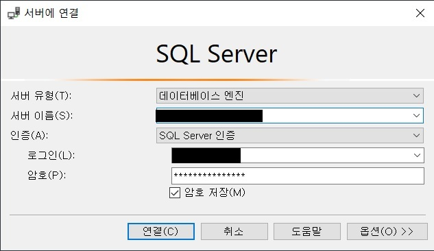

# Android Server 공부
+ [MS-SQL DB를 안드로이드 스튜디오와 연결하기](#ms-sql-db를-안드로이드-스튜디오와-연결하기)
+ [MS-SQL DB 데이터 가져오기](#ms-sql-db-데이터-가져오기)

---

## MS-SQL DB를 안드로이드 스튜디오와 연결하기
> 최초작성 : 2021.05.08

MSSQL DB 구축이 되었다는 가정 하에 MSSQL과 안드로이드 스튜디오를 연결해보겠다.

**1\. DB 연결 데이터를 담을 변수 선언**

```
var ip: String? = "211.187.2.242"	// 서버 ip 주소
val port = "port번호"	// port번호
val Classes = "net.sourceforge.jtds.jdbc.Driver"
val database = "DB명"	//접속할 데이터베이스 이름
val username = "username"	//서버접속용 ID
val password = "password"	//서버접속용 PW
val url = "jdbc:jtds:sqlserver://$ip:$port/$database"   // db 접속 url
var connection: Connection? = null	// DB와 연결하는 객체
```

\* Connection은 데이터베이스와 연결하는 객체

\* 연결문자열(Connection String) - “jdbc:Driver 종류://IP:포트번호/DB명”

\* port 번호는 SQL 구성 관리자에서 TCP/IP 구성 중 모든 IP포트를 설정하는 구간에서 동적 포트를 적으면 된다.

_참고 : [m.blog.naver.com/PostView.nhn?blogId=dktmrorl&logNo=221246505991&proxyReferer=https:%2F%2Fwww.google.com%2F](https://m.blog.naver.com/PostView.nhn?blogId=dktmrorl&logNo=221246505991&proxyReferer=https:%2F%2Fwww.google.com%2F)_

\* username & password는 db 연결 시 로그인(L)과 암호(P) 입력


**2\. DB 연결 함수 생성 후 연결을 원하는 부분에 함수 호출**

```
fun DBConnect() {
  val policy = StrictMode.ThreadPolicy.Builder().permitAll().build()
  StrictMode.setThreadPolicy(policy)

  try {
    //연결시도
    Class.forName(Classes) //jdbc드라이버 클래스 적용
    GlobalVar.connection = DriverManager.getConnection(url, username, password)  // Connection 객체 생성 - db 연결
    Toast.makeText(this, "연결성공", Toast.LENGTH_SHORT).show()
    Log.d(.TAG, "try~catch : 연결성공")
  } catch (e: ClassNotFoundException) {
    e.printStackTrace()
    Toast.makeText(this, "Class를 찾을 수 없음", Toast.LENGTH_SHORT).show()
    Log.d(TAG, "try~catch : Class를 찾을 수 없음")
  } catch (e: SQLException) {
    Toast.makeText(this, "연결실패", Toast.LENGTH_SHORT).show()
    Log.d(TAG, "try~catch : 연결실패")
  }
}
```

\* DriverManager.getConnection(연결문자열, DB\_ID, DB\_PW)으로 Connection 객체를 생성

**3\. 기존에는 위 소스만 사용하여 DB 연결이 성공적으로 되었지만, 새로 프로젝트를 만들고 적용해보니 ClassNotFoundException 에러가 떨어짐**

오류 메세지 : [java.lang.ClassNotFoundException:](http://java.lang.ClassNotFoundException:) [net.sourceforge.jtds.jdbc.Driver](http://net.sourceforge.jtds.jdbc.Driver)

\=> jtds-1.2.5.jar 라이브러리를 추가해야함

**_[3-1) app\\libs 폴더에 jtds-1.2.5.jar 파일 추가](./lib/jtds-1.2.7.jar)_**

**_3-2) build.grale dependcies에 jtds-1.2.5.jar 라이브러리 추가 : implementation files('libs\\\\jtds-1.2.7.jar')_**

**4\. 이번엔 연결 실패 오류(SQLException)**

오류 메세지 : [java.sql.SQLException:](http://java.sql.SQLException:) Network error IOException: socket failed: EACCES (Permission denied)

\=> 위 에러는 안드로이드 스튜디오가 애뮬레이터를 실행했을 때, 인터넷에 연결을 할 수 없기 때문에 뜨는 에러이다.

따라서 인터넷에 연결되도록 설정해주어야 한다.

_**4-1) AndroidManifest.xml에 코드 추가**_
```xml
<uses-permission android:name="android.permission.INTERNET" />**
```

---

## MS-SQL DB 데이터 가져오기
> 최초작성 : 2021.05.08

**1\. 데이터를 관리해주는 데이터 모델 클래스 생성**

```kt
data class  rcv_data_list(var data1: Int,
                      val data2: String,
                      val data3: String)
```

**2\. DB에서 데이터를 긁어와 위 데이터 모델에 추가**

```kt
var data_list = ArrayList<rcv_data_list>()   // DB 데이터를 담을 배열

fun DisplayListView(qry: String?) {
	if (connection != null) {
		var statement: Statement? = null
		statement = connection!!.createStatement()
		//쿼리문을 이용해 가져올 데이터값을 정한다.
		val resultSet: ResultSet = statement.executeQuery(qry)
		while (resultSet.next()) {
			data_list.add(rcv_data_list(R.drawable.img_home
				, resultSet.getString(1)		// db 배열의 첫번째 값
				, resultSet.getString(2)))		// db 배열의 두번째 값
		}

	} else {
		Log.d(GlobalVar.TAG, "연결 없음 실패")
		Toast.makeText(GlobalVar.main_context, "연결 없음 실패", Toast.LENGTH_LONG).show()
	}
}
```

\* 앞서 생성한 데이터 모델 rcv\_data\_list의 형태를 갖는 데이터 리스트 data\_list 생성

\-> 이 배열에 DB 데이터를 담을 예정

\* 나중에 함수를 호출할 때 직접 select 쿼리를 넣어줌으로써 데이터 값을 가져옴

\* DB 데이터를 처음부터 끝까지 읽으면서 해당 값들을 data\_list 배열에 add 해줌


<br>

---

<br>

## DB 데이터를 Fragment 내 RecyclerView에 뿌리기(MS-SQL)
> 최초작성 : 2021.05.08

***[DB 데이터 가져오기 참고문서로 이동](../android-server/android-server-study.md/#ms-sql-db-데이터-가져오기)***

**1\. Fragment 내 RecyclerView 생성**

```xml
<?xml version="1.0" encoding="utf-8"?>
<LinearLayout xmlns:android="http://schemas.android.com/apk/res/android"
    xmlns:tools="http://schemas.android.com/tools"
    android:layout_width="match_parent"
    android:layout_height="match_parent"
    tools:context=".fragment._____">

    <androidx.recyclerview.widget.RecyclerView
        android:id="@+id/recyclerView"
        android:layout_width="match_parent"
        android:layout_height="match_parent"
        android:background="#F0F0F0" />

</LinearLayout>
```

**2\. 리사이클러뷰 내에 들어갈 아이템 xml 만들어주기**

_**\* layout 폴더 마우스 우클릭 > layout resource file 선택 > 해당 파일 생성**_

```xml
<?xml version="1.0" encoding="utf-8"?>
<!--fragment_home.xml 내 리사이클러뷰 상세 레이아웃-->
<LinearLayout xmlns:android="http://schemas.android.com/apk/res/android"
    android:orientation="horizontal" android:layout_width="match_parent"
    android:layout_height="wrap_content"
    android:padding="8dp"
    android:gravity="center_vertical"
    android:layout_marginBottom="8dp"
    android:background="@android:color/white">

    <!--상품 이미지-->
    <ImageView
        android:id="@+id/img_Image"
        android:layout_width="100dp"
        android:layout_height="100dp"
        android:src="@mipmap/ic_launcher"
        android:contentDescription="TODO" />

	<LinearLayout
		android:layout_width="match_parent"
		android:layout_height="wrap_content"
		android:orientation="vertical">

		<TextView
			android:id="@+id/txt_Title"
			android:layout_width="wrap_content"
			android:layout_height="wrap_content"
			android:includeFontPadding="false"
			android:text="TITLE"
			android:textSize="24sp"
			android:textColor="@android:color/black"
			android:textStyle="bold"/>

		<TextView
			android:id="@+id/txt_Category"
			android:layout_width="wrap_content"
			android:layout_height="wrap_content"
			android:includeFontPadding="false"
			android:text="categori"
			android:textSize="15sp"
			android:textColor="@android:color/darker_gray"/>
	</LinearLayout>

</LinearLayout>
```

**3\. 데이터를 관리해주는 데이터 모델 클래스 생성**

```kt
data class  rcv_data_list(var data1: Int,
                      val data2: String,
                      val data3: String)
```

**4\. RecyclerView를 연결하기 위한 Adapter 생성**

```kt
class RecyclerViewAdapter(val list: ArrayList<rcv_data_list>) : RecyclerView.Adapter<RecyclerViewHolder>() {

    // onCreateViewHolder() - 아이템 뷰를 위한 뷰홀더 객체 생성하여 리턴
    override fun onCreateViewHolder(parent: ViewGroup, viewType: Int): RecyclerViewHolder {
        val view = LayoutInflater.from(parent.context).inflate(R.layout.recyclerview, parent, false)
        return HomeFragment_RecyclerViewHolder(view)
    }

    // getItemCount() - 전체 데이터 갯수 리턴
    override fun getItemCount(): Int {
        return list.size
    }

    // onBindViewHolder() - position에 해당하는 데이터를 뷰홀더의 아이템뷰에 표시
    override fun onBindViewHolder(holder: HomeFragment_RecyclerViewHolder, position: Int) {
        holder.holder_data2.text = list.get(position).data2
        holder.holder_data3.text = list.get(position).data3

        // 아이템 클릭 이벤트
        holder.itemView.setOnClickListener {
            // 클릭 시 행동
        }
    }
}
```

\* 앞서 DB 데이터를 저장한 배열 data\_list을 매개변수로 받아와 사용

\* onBindViewHolder에서는 선택된 view의 값을 6번에서 생성할 ViewHolder를 통해 가져온다.

\* ViewHolder의 holder의 itemView가 클릭됨 = RecyclerView 내 아이템이 클림됨

**5\. RecyclerView의 layout\_item과 연결되는 ViewHolder 생성**

```kt
class HomeFragment_RecyclerViewHolder(itemView: View): RecyclerView.ViewHolder(itemView) {
    val holder_data1 = itemView.findViewById<ImageView>(R.id.img_Image)
    val holder_data2 = itemView.findViewById<TextView>(R.id.txt_Title)
    val holder_data3 = itemView.findViewById<TextView>(R.id.txt_Category)
}
```

\* RecyclerView의 Item에 들어있는 값들을 각각 변수에 저장 후 5번 Adapter에서 사용

**6\. Fragment 내에서 위 DB select 함수를 호출하고, 리사이클러뷰와 연결함**

```kt
override fun onViewCreated(view: View, savedInstanceState: Bundle?) {
	super.onViewCreated(view, savedInstanceState)
	try {
		// db 테이블 내 전체 컬럼 호출 후 데이터 배열 저장
		Main_DBConnection.DisplayPrdListView("SELECT * FROM 테이블명")

		RecyclerView.layoutManager = LinearLayoutManager(context, LinearLayoutManager.VERTICAL, false)
		RecyclerView.setHasFixedSize(true)
		RecyclerView.adapter = RecyclerViewAdapter(data_list)

	} catch (e: SQLException) {
		e.printStackTrace()
	}
}
```

_**6-1) 리사이클러뷰는 LinearLayoutManager를 통해 4가지 형태로 만들 수 있다.**_

   \* 세로 레이아웃 : 세로 스크롤이 가능 -> LinearLayoutManager(this, LinearLayoutManager.VERTICAL, false)

   \* 가로 레이아웃 : 가로 스크롤이 가능 -> LinearLayoutManager(this, LinearLayoutManager.HORIZONTAL, false)

   \* 불규칙 레이아웃 : 아이템의 높이에 따라 불규칙 적으로 타일 배치

   \* 그리드 레이아웃 : 타일 느낌의 뷰를 생성할 수 있음

_**6-2) RecyclerView.setHasFixedSize(true)의 의미**_

   \* 아이템 항목을 추가할 때마다 리사이클러뷰의 크기는 변경

     > 레이아웃을 그릴 때, 크기를 측정하고 다시 그리는 것을 반복

     > setHasFixedSize는 크기 변경이 일정하다는 것을 사용자의 입력으로 확인

       _: 항목의 높이나 너비가 변경되지 않으며, 추가 또는 제거된 모든 항목은 동일_