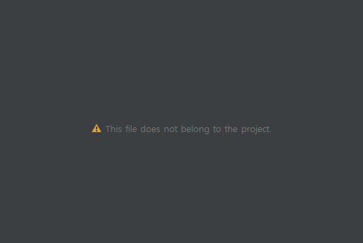

# This file does not belong to the project
> 최초작성 : 2021.05.27

프로젝트를 복사한 뒤, 프로젝트 명을 바꾸고 xml 파일을 열어 디자인을 보려고 하니

**This file does not belong to the project**

라는 문구가 떴다.

Project로 변경한 뒤 .idea 폴더에 있는 workspace 파일을 삭제한 뒤 Android Studio를 재실행해준다.