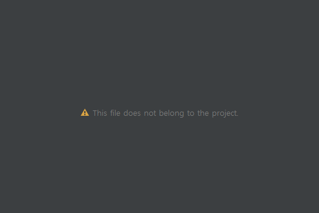

# Android 에러 사항 정리

* [This file does not belong to the project](#This-file-does-not-belong-to-the-project)
* [not permitted by network security policy](#not-permitted-by-network-security-policy)
* [This version of the Android Support plugin for IntelliJ IDEA](#this-version-of-the-android-support-plugin-for-intellij-idea)
* [onError: retrofit2.adapter.rxjava3.HttpException: HTTP 404 Not Found](#onerror-retrofit2adapterrxjava3httpexception-http-404-not-found)
* [java.lang.NumberFormatException: Expected an int but was 106112471000]

----
<br>
<br>

# This file does not belong to the project
> 최초작성 : 2021.05.27



프로젝트를 복사한 뒤, 프로젝트 명을 바꾸고 xml 파일을 열어 디자인을 보려고 하니

**This file does not belong to the project**

라는 문구가 떴다.


Project로 변경한 뒤 .idea 폴더에 있는 workspace 파일을 삭제한 뒤 Android Studio를 재실행해준다.

<br>
<br>

# not permitted by network security policy
> 최초작성 : 2021.06.09

> 기존 Web 링크로 된 서버를 로컬 서버로 연결하려고 바꾸니 'not permitted by network security policy' 에러가 발생.

> 안드로이드 9.0(Pie) 버전 이상부터는 https를 기본값으로 지정했는데, http를 연결하려니 발생한 오류였음.

> 이때 http로 구축된 서버를 억지로 https로 바꾸면 time out 오류가 발생함.

> 아래 방법 중 하나를 선택하면 해결 가능함. (https가 아니어도 연결을 허용한다는 뜻)

## 1. AndroidManifest.xml 파일의 <application> 부분에 android:usesCleartextTraffic="true" 로 설정

## 2. res>xml 폴더에 network_security_config.xml파일을 생성하고, AndroidManifest 에 등록


*<xml/network_security_config.xml>*


```xml
<?xml version="1.0" encoding="utf-8"?>
<network-security-config>
    <domain-config cleartextTrafficPermitted="true">
        <domain includeSubdomains="true">허용할 도메인 주소</domain>
    </domain-config>
</network-security-config>
```

*<AndroidManifest.xml>*

```xml
<application 
    android:networkSecurityConfig="@xml/network_security_config" ~~~ >
</application>
```

<br>
<br>

---

# This version of the Android Support plugin for IntelliJ IDEA
> 최초작성 : 2022.03.28


두 대의 노트북으로 개발을 하다보니 한 노트북에서는 다음과 같은 오류가 났다.

해당 문제는 안드로이드 스튜디오 버전이 맞지 않을 경우 생기는 문제이다.

해결 1. 낮은 버전의 안드로이드 스튜디오를 업데이트하여 높은 버전과 맞춰준다.

해결 2. 아래 buildscript를 build.gradle(project)에 추가해준다.
```gradle
buildscript {
    repositories {
        google()
        mavenCentral()
    }
    dependencies {
        classpath "com.android.tools.build:gradle:7.0.2"

    }
}

plugins {
    id 'com.android.application' version '7.0.0' apply false
    id 'com.android.library' version '7.0.0' apply false
    id 'org.jetbrains.kotlin.android' version '1.6.10' apply false
}
```

* * *

# onError: retrofit2.adapter.rxjava3.HttpException: HTTP 404 Not Found
> 최초작성 : 2022.05.17

RxJava3와 Retrofit2을 이용하여 로또 당첨 번호를 조회하는 도중 해당 오류를 만났다.

404 오류는 주소가 틀렸을 때 나타나는 오류이다.

### 1\. retrofit init은 다음과 같다.
```kt
init {
    val retrofit = Retrofit.Builder()
        .baseUrl("https://www.dhlottery.co.kr/common.do/")
        .client(OkHttpClient())
        .addCallAdapterFactory(RxJava3CallAdapterFactory.create())   // 받은 응답을 observable 형태로 변환
        .addConverterFactory(GsonConverterFactory.create())
        .build()

    api = retrofit.create(LottoApi::class.java)
}
```

### 2\. get 주소는 다음과 같다.
```kt
@GET("common.do")
fun getLottoWinnerNumber(
    @Query("method") method: String = "getLottoNumber",
    @Query("drwNo") drwNo: Int,
): Observable<LotteryNumber>
```

멍청한 결과지만 common.do를 동시에 적어서 발생한 오류였다...

* * *

# java.lang.NumberFormatException: Expected an int but was 106112471000
> 최초작성 : 2022.05.17

위와 연결하여 로또 당첨번호를 받아오는 도중 다음과 같은 에러를 만났다.

느낌에 106112471000를 포맷화할 수 없어 생긴 오류 같았다.

106112471000는 해당 로또 회차의 총 판매금액이었고, 이걸 나는 Int로 받아오고 있었다.

받아오는 변수 타입을 Long으로 바꿔주면 된다.


* long 최대값 : 9,223,372,036,854,775,807
* int 최대값 : 2,147,483,647