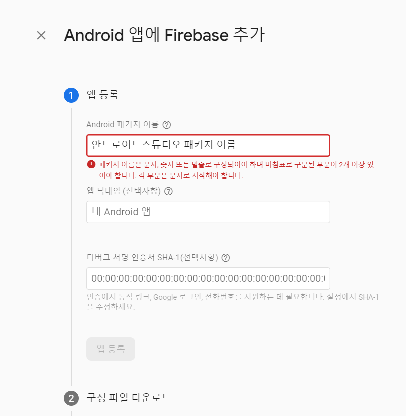
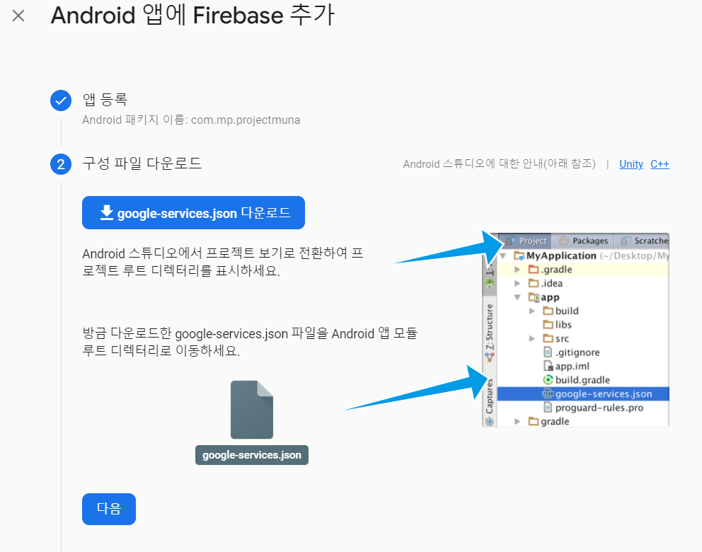
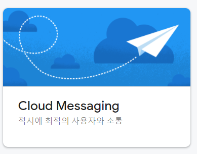
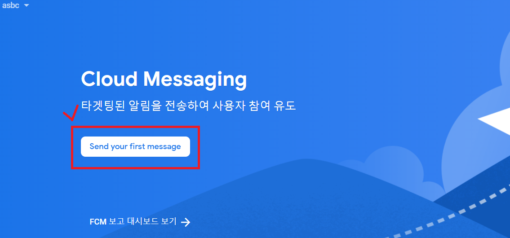
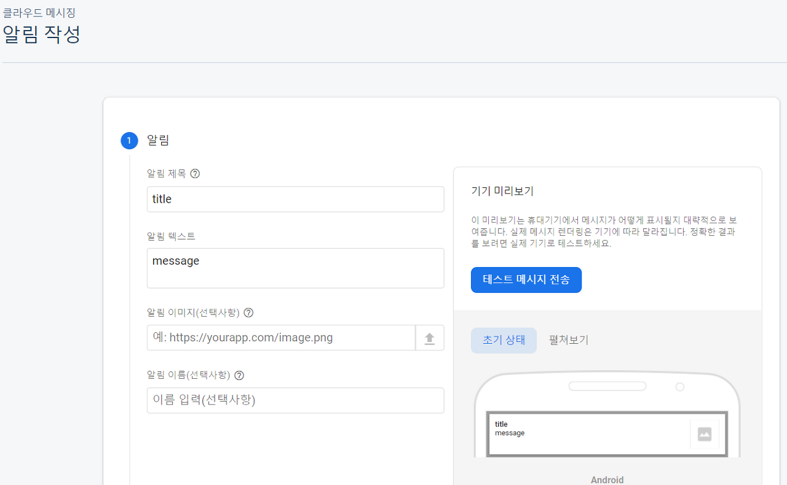
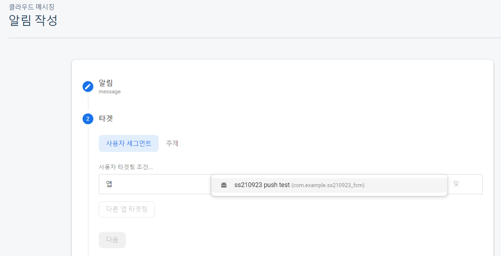
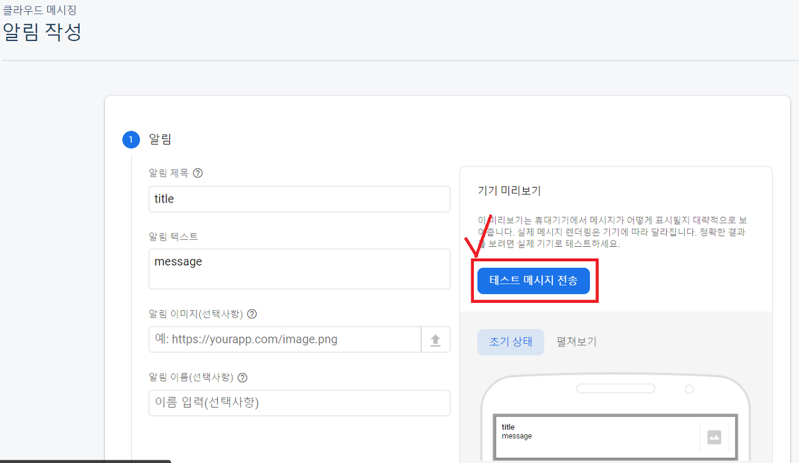
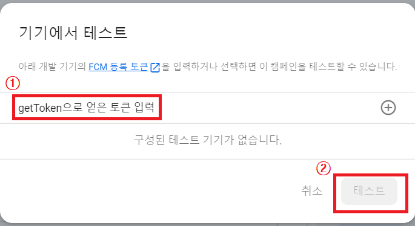

# FCM(Firebase Cloud Messaging) 푸시 알람 구현

> 최초작성 : 2021.09.23

_**[Android에서 Firebase 클라우드 메시징 클라이언트 앱 설정으로 이동](https://firebase.google.com/docs/cloud-messaging/android/client?hl=ko)**_

**01\. Firebase Console에 프로젝트 생성**

 _**[Firebase Console로 이동](https://console.firebase.google.com/u/1/?hl=ko)**_

**02\. google-service.json을 안드로이드 스튜디오에 추가**





**03\. gradle 세팅**

_**<build.gradle(Project)>**_

```gradle
dependencies {
  classpath "com.google.gms:google-services:4.3.10"
  ...
}
```

_**<build.gradle(Module)>**_

```gradle
plugins {
    id 'com.android.application'
    id 'com.google.gms.google-services'	// 추가
}

...

dependencies {
    implementation 'com.google.firebase:firebase-messaging:22.0.0'
	...
}
```

**04\. FirebaseMessagingService를 extends하는 클래스 생성 (push 기능 설정)**

_**<Java를 이용한 샘플 코드>**_

```java
public class FirebaseMessagingService extends com.google.firebase.messaging.FirebaseMessagingService {
    private static final String TAG = "FirebaseMessagingService";
    private static final String CHANNEL_ID = "channel1";
    private static final String CHANNEL_NAME = "channel";
    private String title, msg;
    @Override
    public void onNewToken(@NonNull String token) {
        Log.d(TAG, "Refreshed token: " + token);
        sendRegistrationToServer(token);
    }

    private void sendRegistrationToServer(String token) {
        // TODO: Implement this method to send token to your app server.
    }

    @Override
    public void onMessageReceived(@NonNull RemoteMessage remoteMessage) {
        Log.e(TAG,"onMessageReceived");

        title = remoteMessage.getNotification().getTitle();
        msg = remoteMessage.getNotification().getBody();

        Intent intent = new Intent(this, MainActivity.class);
        intent.addFlags(Intent.FLAG_ACTIVITY_CLEAR_TOP);

        PendingIntent contentIntent = PendingIntent.getActivity(this, 0, new Intent(this, MainActivity.class), 0);

        NotificationManagerCompat notificationManagerCompat = NotificationManagerCompat.from(getApplicationContext());

        NotificationCompat.Builder builder;
        if (Build.VERSION.SDK_INT >= Build.VERSION_CODES.O) {
            if (notificationManagerCompat.getNotificationChannel(CHANNEL_ID) == null) {
                NotificationChannel channel = new NotificationChannel(CHANNEL_ID, CHANNEL_NAME, NotificationManager.IMPORTANCE_DEFAULT);
                notificationManagerCompat.createNotificationChannel(channel);
            }
            builder = new NotificationCompat.Builder(getApplicationContext(), CHANNEL_ID);
        }else {
            builder = new NotificationCompat.Builder(getApplicationContext());
        }

        builder.setSmallIcon(R.mipmap.ic_launcher)
                .setContentTitle(title)	// push title
                .setContentText(msg)	// push message
                .setAutoCancel(true)
                .setSound(RingtoneManager.getDefaultUri(RingtoneManager.TYPE_NOTIFICATION))	// 소리
                .setVibrate(new long[]{1, 1000});	// 진동


        notificationManagerCompat.notify(0, builder.build());
        builder.setContentIntent(contentIntent);
    }
}
```

_**<Kotlin을 이용한 샘플 코드>**_

```kt
class MyFirebaseMessagingService : FirebaseMessagingService() {
    val CHANNEL_ID = "channel1"
    val CHANNEL_NAME = "channel"
    private var title: String? = null
    private var msg: String? = null

    override fun onNewToken(token: String) {
        Log.d("TAG", "Refreshed token: $token")
        sendRegistrationToServer(token)
    }
    private fun sendRegistrationToServer(token: String) {
        // TODO: Implement this method to send token to your app server.
    }

    override fun onMessageReceived(remoteMessage: RemoteMessage) {
        Log.e("TAG", "onMessageReceived")
        title = remoteMessage.notification!!.title
        msg = remoteMessage.notification!!.body
        val intent = Intent(this, MainActivity::class.java)
        intent.addFlags(Intent.FLAG_ACTIVITY_CLEAR_TOP)

        val contentIntent = PendingIntent.getActivity(this, 0, Intent(this, MainActivity::class.java), 0)
        val notificationManagerCompat = NotificationManagerCompat.from(applicationContext)
        val builder: NotificationCompat.Builder = if (Build.VERSION.SDK_INT >= Build.VERSION_CODES.O) {
            if (notificationManagerCompat.getNotificationChannel(CHANNEL_ID) == null) {
                val channel = NotificationChannel(CHANNEL_ID, CHANNEL_NAME, NotificationManager.IMPORTANCE_DEFAULT)
                notificationManagerCompat.createNotificationChannel(channel)
            }
            NotificationCompat.Builder(applicationContext, CHANNEL_ID)
        } else {
            NotificationCompat.Builder(applicationContext)
        }
        builder.setSmallIcon(R.mipmap.ic_launcher)
                .setContentTitle(title)	// push title
                .setContentText(msg)	// push message
                .setAutoCancel(true)
                .setSound(RingtoneManager.getDefaultUri(RingtoneManager.TYPE_NOTIFICATION))	// 소리
                .setVibrate(longArrayOf(1, 1000))	// 진동
        notificationManagerCompat.notify(0, builder.build())
        builder.setContentIntent(contentIntent)
    }
}
```

**\* onNewToken 호출 상황**

1) 최초 앱 시작 시 새로운 토큰이 생성되는 경우

2) 기존 토큰이 변경될 때마다

   a. 앱이 새 기기로 복원됨

   b. 사용자가 앱을 제거/재설치하는 경우

   c. 사용자가 앱 데이터 삭제

**\* PendingIntent를 이용해서 Push 메세지 선택 시 Activity 실행**

**05\. AndroidManifest.xml 설정**

```xml
<application
	android:allowBackup="true"
...
	<!-- 자동 초기화 방지 -->
	<meta-data
		android:name="firebase_messaging_auto_init_enabled"
		android:value="false" />
	<meta-data
		android:name="firebase_analytics_collection_enabled"
		android:value="false" />
...
	<service
	android:name=".FirebaseMessagingService"
	android:exported="false">
	<intent-filter>
		<action android:name="com.google.firebase.MESSAGING_EVENT" />
		<action android:name="com.google.firebase.INSTANCE_ID_EVENT" />
	</intent-filter>
	</service>
</application>
```

**06\. Firebase Console을 통해 Push 알람 보내기**

01. Cloud Messaging으로 들어가기



02. Send your first message 클릭



03. [새알림] 버튼 클릭


04. push 메세지 작성



05. 타겟 설정



06. 알림 보내기


**07\. 토큰을 이용해 테스트를 원하는 기기에만 Push 전송**

_**<res/values/strings.xml>**_

```xml
<string name="msg_token_fmt" translatable="false">토큰 : %s</string>
```

**_<Java를 이용한 샘플 코드>_**

```java
// 토큰 받기
FirebaseMessaging.getInstance().getToken()
		.addOnCompleteListener(new OnCompleteListener<String>() {
			@Override
			public void onComplete(@NonNull Task<String> task) {
				if (!task.isSuccessful()) {
					Log.w("TAG", "Fetching FCM registration token failed", task.getException());
					return;
				}

				// Get new FCM registration token
				String token = task.getResult();

				// Log and toast
                String msg = getString(R.string.msg_token_fmt, token);
				Log.d("TAG", msg);
				Toast.makeText(MainActivity.this, msg, Toast.LENGTH_SHORT).show();
			}
		});​
```

**_<Kotlin을 이용한 샘플 코드>_**

```kt
FirebaseMessaging.getInstance().token.addOnCompleteListener(OnCompleteListener { task ->
	if (!task.isSuccessful) {
		Log.w("TAG", "Fetching FCM registration token failed", task.exception)
		return@OnCompleteListener
	}

	// Get new FCM registration token
	val token = task.result

	// Log and toast
	val msg = getString(R.string.msg_token_fmt, token)
	Log.d("TAG", msg)
	Toast.makeText(baseContext, msg, Toast.LENGTH_SHORT).show()
})
```

01. [테스트 메시지 전송] 버튼 클릭



02. 토큰 입력 후 테스트 버튼 클릭




**08\. 실행화면**


