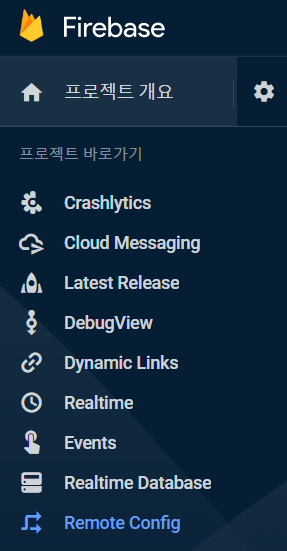
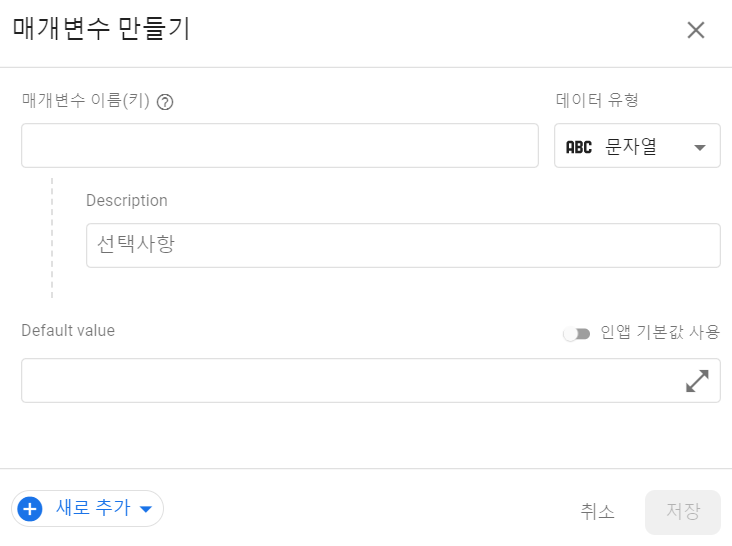
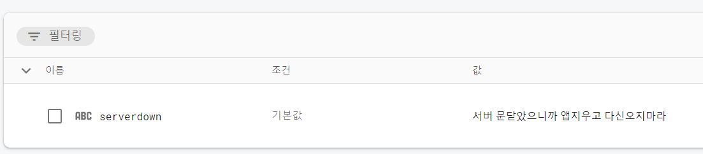

# Android에서 Firebase의 Remote Config 사용하기

> 최초작성 : 2022. 10. 13 (목)

### 1. Firebase Console에서 Remote Config 추가하기

#### (1) Firebase Console로 들어간 뒤 메뉴에서 Remote Config 페이지로 접속한다.


#### (2) 매개변수를 추가한다.



#### (3) 작성이 완료되면 아래와 같이 나온다.



<br>

### 2. Android에서 Remote Config 값 가져오기 (kotlin)


#### (1) gradle:app 추가
```gradle
implementation platform('com.google.firebase:firebase-bom:28.4.2')
implementation 'com.google.firebase:firebase-analytics-ktx'
implementation 'com.google.firebase:firebase-config-ktx'
```

#### (2) RemoteConfig 세팅
``` kt
private val REMOTE_CONFIG_KEY = "serverdown"

private fun setupRemoteConfig() {
        remoteConfig.setConfigSettingsAsync(
                remoteConfigSettings {
                        minimumFetchIntervalInSeconds = 0
                }
        )
        remoteConfig.setDefaultsAsync(
                mapOf(REMOTE_CONFIG_KEY to "")
        )
}
```
	• minimumFetchIntervalInSeconds: 설정한 초만큼 interval을 가지고 불러옴
	• 0으로 설정하면 바로 불러오게 되는 것

#### (3) RemoteConfig 메시지 사용하기
``` kt
remoteConfig.fetchAndActivate()
        .addOnCompleteListener {
                if (it.isSuccessful) {
                        val msg = remoteConfig.getString(REMOTE_CONFIG_KEY)
                }
        }
```