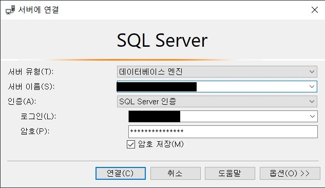

# Android Server 공부
+ [MS-SQL DB를 안드로이드 스튜디오와 연결하기](#ms-sql-db를-안드로이드-스튜디오와-연결하기)
+ [MS-SQL DB 데이터 가져오기](#ms-sql-db-데이터-가져오기)

---

## MS-SQL DB를 안드로이드 스튜디오와 연결하기
> 최초작성 : 2021.05.08

MSSQL DB 구축이 되었다는 가정 하에 MSSQL과 안드로이드 스튜디오를 연결해보겠다.

**1\. DB 연결 데이터를 담을 변수 선언**

```
var ip: String? = "211.187.2.242"	// 서버 ip 주소
val port = "port번호"	// port번호
val Classes = "net.sourceforge.jtds.jdbc.Driver"
val database = "DB명"	//접속할 데이터베이스 이름
val username = "username"	//서버접속용 ID
val password = "password"	//서버접속용 PW
val url = "jdbc:jtds:sqlserver://$ip:$port/$database"   // db 접속 url
var connection: Connection? = null	// DB와 연결하는 객체
```

\* Connection은 데이터베이스와 연결하는 객체

\* 연결문자열(Connection String) - “jdbc:Driver 종류://IP:포트번호/DB명”

\* port 번호는 SQL 구성 관리자에서 TCP/IP 구성 중 모든 IP포트를 설정하는 구간에서 동적 포트를 적으면 된다.

_참고 : [m.blog.naver.com/PostView.nhn?blogId=dktmrorl&logNo=221246505991&proxyReferer=https:%2F%2Fwww.google.com%2F](https://m.blog.naver.com/PostView.nhn?blogId=dktmrorl&logNo=221246505991&proxyReferer=https:%2F%2Fwww.google.com%2F)_

\* username & password는 db 연결 시 로그인(L)과 암호(P) 입력


**2\. DB 연결 함수 생성 후 연결을 원하는 부분에 함수 호출**

```
fun DBConnect() {
  val policy = StrictMode.ThreadPolicy.Builder().permitAll().build()
  StrictMode.setThreadPolicy(policy)

  try {
    //연결시도
    Class.forName(Classes) //jdbc드라이버 클래스 적용
    GlobalVar.connection = DriverManager.getConnection(url, username, password)  // Connection 객체 생성 - db 연결
    Toast.makeText(this, "연결성공", Toast.LENGTH_SHORT).show()
    Log.d(.TAG, "try~catch : 연결성공")
  } catch (e: ClassNotFoundException) {
    e.printStackTrace()
    Toast.makeText(this, "Class를 찾을 수 없음", Toast.LENGTH_SHORT).show()
    Log.d(TAG, "try~catch : Class를 찾을 수 없음")
  } catch (e: SQLException) {
    Toast.makeText(this, "연결실패", Toast.LENGTH_SHORT).show()
    Log.d(TAG, "try~catch : 연결실패")
  }
}
```

\* DriverManager.getConnection(연결문자열, DB\_ID, DB\_PW)으로 Connection 객체를 생성

**3\. 기존에는 위 소스만 사용하여 DB 연결이 성공적으로 되었지만, 새로 프로젝트를 만들고 적용해보니 ClassNotFoundException 에러가 떨어짐**

오류 메세지 : [java.lang.ClassNotFoundException:](http://java.lang.ClassNotFoundException:) [net.sourceforge.jtds.jdbc.Driver](http://net.sourceforge.jtds.jdbc.Driver)

\=> jtds-1.2.5.jar 라이브러리를 추가해야함

**_[3-1) app\\libs 폴더에 jtds-1.2.5.jar 파일 추가](./lib/jtds-1.2.7.jar)_**

**_3-2) build.grale dependcies에 jtds-1.2.5.jar 라이브러리 추가 : implementation files('libs\\\\jtds-1.2.7.jar')_**

**4\. 이번엔 연결 실패 오류(SQLException)**

오류 메세지 : [java.sql.SQLException:](http://java.sql.SQLException:) Network error IOException: socket failed: EACCES (Permission denied)

\=> 위 에러는 안드로이드 스튜디오가 애뮬레이터를 실행했을 때, 인터넷에 연결을 할 수 없기 때문에 뜨는 에러이다.

따라서 인터넷에 연결되도록 설정해주어야 한다.

_**4-1) AndroidManifest.xml에 코드 추가**_
```xml
<uses-permission android:name="android.permission.INTERNET" />**
```

---

## MS-SQL DB 데이터 가져오기
> 최초작성 : 2021.05.08

**1\. 데이터를 관리해주는 데이터 모델 클래스 생성**

```kt
data class  rcv_data_list(var data1: Int,
                      val data2: String,
                      val data3: String)
```

**2\. DB에서 데이터를 긁어와 위 데이터 모델에 추가**

```kt
var data_list = ArrayList<rcv_data_list>()   // DB 데이터를 담을 배열

fun DisplayListView(qry: String?) {
	if (connection != null) {
		var statement: Statement? = null
		statement = connection!!.createStatement()
		//쿼리문을 이용해 가져올 데이터값을 정한다.
		val resultSet: ResultSet = statement.executeQuery(qry)
		while (resultSet.next()) {
			data_list.add(rcv_data_list(R.drawable.img_home
				, resultSet.getString(1)		// db 배열의 첫번째 값
				, resultSet.getString(2)))		// db 배열의 두번째 값
		}

	} else {
		Log.d(GlobalVar.TAG, "연결 없음 실패")
		Toast.makeText(GlobalVar.main_context, "연결 없음 실패", Toast.LENGTH_LONG).show()
	}
}
```

\* 앞서 생성한 데이터 모델 rcv\_data\_list의 형태를 갖는 데이터 리스트 data\_list 생성

\-> 이 배열에 DB 데이터를 담을 예정

\* 나중에 함수를 호출할 때 직접 select 쿼리를 넣어줌으로써 데이터 값을 가져옴

\* DB 데이터를 처음부터 끝까지 읽으면서 해당 값들을 data\_list 배열에 add 해줌