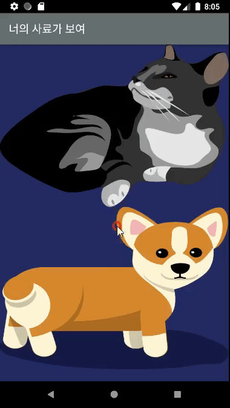

# ListView

### 01. ListView 생성하기
> 최초작성 : 2021.02.03



1\. activity\_dog\_main.xml 에 리스트뷰 생성

```xml
<?xml version="1.0" encoding="utf-8"?>
<LinearLayout xmlns:android="http://schemas.android.com/apk/res/android"
    xmlns:app="http://schemas.android.com/apk/res-auto"
    xmlns:tools="http://schemas.android.com/tools"
    android:layout_width="match_parent"
    android:layout_height="match_parent"
    android:orientation="vertical"
    tools:context=".DogMainActivity">

    <ListView
        android:id="@+id/listView"
        android:layout_width="match_parent"
        android:layout_height="match_parent"
        app:layout_constraintBottom_toBottomOf="parent"
        app:layout_constraintEnd_toEndOf="parent"
        app:layout_constraintHorizontal_bias="0.0"
        app:layout_constraintStart_toStartOf="parent"
        app:layout_constraintTop_toTopOf="parent" />
        
 </LinearLayout>
```

2\. 위 리스트뷰 안에 들어갈 레이아웃 생성 (activity\_list\_item.xml)

```xml
<?xml version="1.0" encoding="utf-8"?>
<LinearLayout
    xmlns:android="http://schemas.android.com/apk/res/android"
    xmlns:tools="http://schemas.android.com/tools"
    xmlns:app="http://schemas.android.com/apk/res-auto"
    android:layout_width="match_parent"
    android:layout_height="match_parent"
    tools:context=".list_item">

    <ImageView
        android:id="@+id/imageView1"
        android:layout_width="50dp"
        android:layout_height="100dp"
        android:layout_weight="2"
        android:background="@drawable/cat"
        android:scaleType="centerInside" />

    <LinearLayout
        android:layout_width="wrap_content"
        android:layout_height="match_parent"
        android:layout_weight="9"
        android:orientation="vertical"
        android:weightSum="10">

        <TextView
            android:id="@+id/textView1"
            android:layout_width="match_parent"
            android:layout_height="134dp"
            android:layout_weight="2"
            android:gravity="center_vertical"
            android:text="New Text"
            android:layout_margin="10dp"
            android:textSize="24dp" />

        <TextView
            android:id="@+id/textView2"
            android:layout_width="match_parent"
            android:layout_height="470dp"
            android:layout_weight="6"
            android:text="New Text"
            android:layout_margin="10dp"
            android:textSize="16dp" />

    </LinearLayout>

  </LinearLayout>
```

\* 이미지는 임시로 고양이 이미지 사용

3\. 데이터를 받을 list\_item.java 클래스 생성

```java
public class list_item extends AppCompatActivity {
    public String name;
    public String desc;

    @Override
    protected void onCreate(Bundle savedInstanceState) {
        super.onCreate(savedInstanceState);
        setContentView(R.layout.activity_list_item);
    }

    public list_item(String name, String desc) {
        this.name = name;
        this.desc = desc;
    }

    public String getName()
    {
        return this.name;
    }

    public String getDesc()
    {
        return this.desc;
    }
}
```

4\. dog\_main과 list\_item 클래스를 연결해줄 ListViewAdapter.java 클래스 생성

```java
public class ListViewAdapter extends BaseAdapter {

    Context mContext = null;
    LayoutInflater mLayoutInflater = null;
    ArrayList<list_item> list;

    public ListViewAdapter(Context context, ArrayList<list_item> listViewItemList) {
        mContext = context;
        list = listViewItemList;
        mLayoutInflater = LayoutInflater.from(mContext);
    }

    @Override
    public int getCount() {
        return list.size();
    }

    @Override
    public long getItemId(int position) {
        return position;
    }

    @Override
    public Object getItem(int position) {
        return list.get(position);
    }

    @Override
    public View  getView(int position, View convertView, ViewGroup parent) {
        View view = mLayoutInflater.inflate(R.layout.activity_list_item, null);

        TextView titleTextView = (TextView) view.findViewById(R.id.textView1) ;
        TextView descTextView = (TextView) view.findViewById(R.id.textView2) ;

        titleTextView.setText(list.get(position).getName());
        descTextView.setText(list.get(position).getDesc());

        return view;
    }

}
```

5\. DogMainActivity.java

```java
this.InitializeData();

ListView listview = (ListView) findViewById(R.id.listView);
final ListViewAdapter adapter = new ListViewAdapter(this,DataList);
listview.setAdapter(adapter);

listview.setOnItemClickListener(new AdapterView.OnItemClickListener(){
@Override
public void onItemClick(AdapterView parent, View v, int position, long id){

}
});

XmlPullParser_fsk fsk = new XmlPullParser_fsk();
```

```java
private void InitializeData() {
    DataList = new ArrayList<list_item>();
    DataList.add(new list_item("test1","울랄라1"));
    DataList.add(new list_item("tt2","룰루2"));
    DataList.add(new list_item("test3","울랄라3"));
    DataList.add(new list_item("tt4","울랄라4"));
    DataList.add(new list_item("test5","룰루5"));
    DataList.add(new list_item("test6","울랄라6"));
    DataList.add(new list_item("test7","룰루7"));
    DataList.add(new list_item("tt8","울랄라8"));
}
```

---

### 02. ListView Click Event : 팝업창 생성
> 최초작성 : 2021.02.07


**1\. 팝업창 activity를 생성해준다. (PopupActivity.java, activity\_popup.xml)**

```java
public class PopupActivity extends Activity {

    TextView txtText;

    @Override
    protected void onCreate(Bundle savedInstanceState) {
        super.onCreate(savedInstanceState);
        setContentView(R.layout.activity_popup);

        //UI 객체생성
        txtText = (TextView)findViewById(R.id.txtPopup);

        //데이터 가져오기
        Intent intent = getIntent();
        String data = intent.getStringExtra("data");
        txtText.setText(data);
    }
}
```

\* extends AppCompatActivity를 extends Activity로 변경!!

   AndroidManifest.java 수정 시 충동 생김

**2\. AndroidManifest.java에서 PopupActivity을 Dialog로 변경 (팝업화면)**

```xml
<activity android:name=".PopupActivity" android:theme="@android:style/Theme.Dialog"></activity>
```

**3\. DogMainActivity.java에서 리스트뷰 내 아이템 선택 시 팝업화면 호출**

```java
ListView listview = (ListView) findViewById(R.id.listView);

listview.setOnItemClickListener(new AdapterView.OnItemClickListener(){
  @Override
  public void onItemClick(AdapterView parent, View v, int position, long id){
    String value = "TestPopup \n TestPopup \n TestPopup \n TestPopup "
    	+ "\n TestPopup \n TestPopup \n TestPopup \n TestPopup "
    	+ "\n TestPopup \n TestPopup \n TestPopup \n TestPopup"	// 테스트 문구;
    Log.d(TAG, "선택했어요.");
    Intent intent = new Intent(DogMainActivity.this, PopupActivity.class);
    intent.putExtra("data", value);
    startActivityForResult(intent, 1);
  }
});
```

---

### 03. ListView Search 기능 만들기
> 최초작성 : 2021.02.08


**1\. DogMainActivity.java 내에서 액션바 기능 넣어주기**

```java
@Override
public boolean onCreateOptionsMenu(Menu menu) {
  MenuInflater inflater = getMenuInflater();
  inflater.inflate(R.menu.activity_actionbar_search, menu);

  MenuItem menuItem = menu.findItem(R.id.action_search);
  searchView = (SearchView)menuItem.getActionView();
  searchView.setQueryHint("사료명으로 검색합니다.");
  searchView.setOnQueryTextListener(queryTextListener);

  return super.onCreateOptionsMenu(menu);
}
```

이 때 자꾸 _searchview cannot be cast to android.widget.searchView_ 라는 오류가 났는데

기존 액션바에 검색 기능을 추가할 때

_androidx.appcompat.widget.SearchView_ 를 _android.widget.SearchView_ 로 바꿔주니 해결됐다.

```xml
<?xml version="1.0" encoding="utf-8"?>
<menu xmlns:android="http://schemas.android.com/apk/res/android"
    xmlns:app="http://schemas.android.com/apk/res-auto">

    <item
        android:id="@+id/action_search"
        android:icon="@drawable/menu_search"
        android:title="Search"
        android:orderInCategory="102"
        app:showAsAction="always"
        app:actionViewClass="android.widget.SearchView"/>    <!--이 부분 수정-->

</menu>
```

**2\. 일단 리스트에 넣은 데이터를 따로 복사해두고 거기서 꺼내오는 방법을 사용**

```java
// 검색창에 글자를 입력했을 때 실행코드
private SearchView.OnQueryTextListener queryTextListener = new SearchView.OnQueryTextListener() {
	@Override
	public boolean onQueryTextSubmit(String s) {
		DataList.clear();
		if (s.length() == 0)
			DataList.addAll(searchList);
		else {
			for (int i=0; i<searchList.size(); i++)
			{
				if(searchList.get(i).name.contains(s))
					DataList.add(searchList.get(i));
			}
		}

		adapter.notifyDataSetChanged();
		return false;
	}

	@Override
	public boolean onQueryTextChange(String s) {
		DataList.clear();
		if (s.length() == 0)
			DataList.addAll(searchList);
		else {
			for (int i=0; i<searchList.size(); i++)
			{
				if(searchList.get(i).name.contains(s))
					DataList.add(searchList.get(i));
			}
		}

		adapter.notifyDataSetChanged();
		return false;
	}
};
```