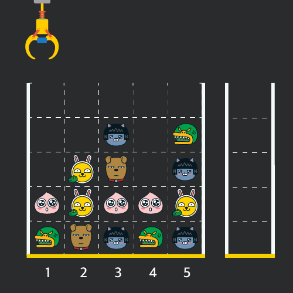
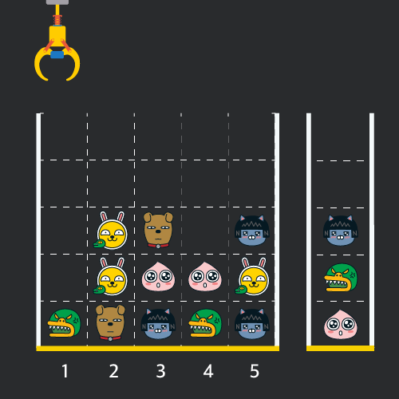
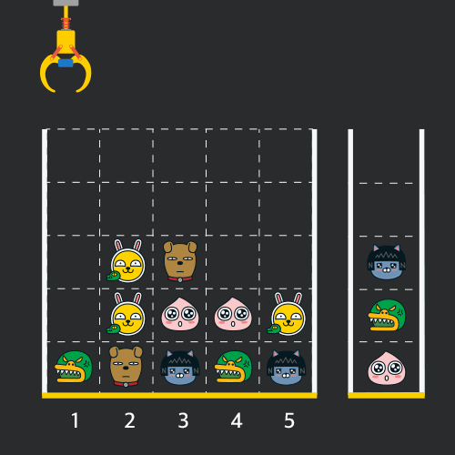
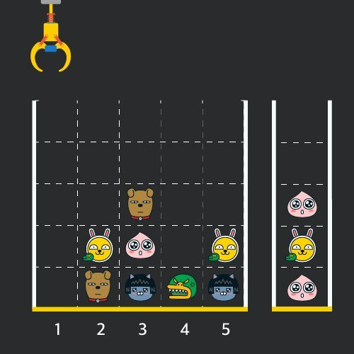
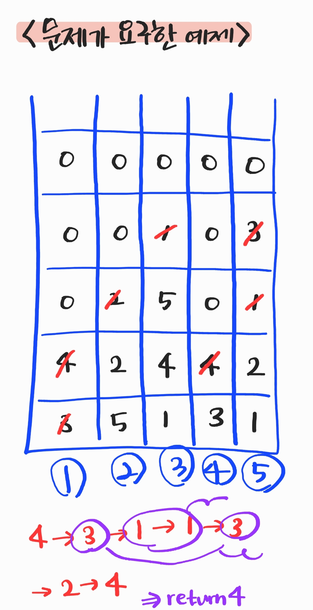

> 최초작성 : 2021.01.25

## ******Level1 - 크레인 인형뽑기 게임**** (java/kotlin)**

 [코딩테스트 연습 - 크레인 인형뽑기 게임](https://programmers.co.kr/learn/courses/30/lessons/64061)

| **문제 설명** |
| --- |
| 게임개발자인 죠르디는 크레인 인형뽑기 기계를 모바일 게임으로 만들려고 합니다.<br>죠르디는 게임의 재미를 높이기 위해 화면 구성과 규칙을 다음과 같이 게임 로직에 반영하려고 합니다.<br><br>게임 화면은 **1 x 1** 크기의 칸들로 이루어진 **N x N** 크기의 정사각 격자이며 위쪽에는 크레인이 있고 오른쪽에는 바구니가 있습니다.<br>(위 그림은 5 x 5 크기의 예시입니다)<br>각 격자 칸에는 다양한 인형이 들어 있으며 인형이 없는 칸은 빈칸입니다.<br>모든 인형은 1 x 1 크기의 격자 한 칸을 차지하며 **격자의 가장 아래 칸부터 차곡차곡 쌓여 있습니다.** <br>게임 사용자는 크레인을 좌우로 움직여서 멈춘 위치에서 가장 위에 있는 인형을 집어 올릴 수 있습니다.<br>집어 올린 인형은 바구니에 쌓이게 되는 데, 이때 바구니의 가장 아래 칸부터 인형이 순서대로 쌓이게 됩니다.<br>다음 그림은 \[1번, 5번, 3번\] 위치에서 순서대로 인형을 집어 올려 바구니에 담은 모습입니다.<br><br>만약 같은 모양의 인형 두 개가 바구니에 연속해서 쌓이게 되면 두 인형은 터뜨려지면서 바구니에서 사라지게 됩니다.<br>위 상태에서 이어서 \[5번\] 위치에서 인형을 집어 바구니에 쌓으면 같은 모양 인형 **두 개**가 없어집니다.<br><br>크레인 작동 시 인형이 집어지지 않는 경우는 없으나 만약 인형이 없는 곳에서 크레인을 작동시키는 경우에는<br>아무런 일도 일어나지 않습니다.<br>또한 바구니는 모든 인형이 들어갈 수 있을 만큼 충분히 크다고 가정합니다. (그림에서는 화면표시 제약으로 5칸만으로 표현하였음)<br>게임 화면의 격자의 상태가 담긴 2차원 배열 board와 인형을 집기 위해 크레인을 작동시킨 위치가 담긴 배열 moves가<br>매개변수로 주어질 때, 크레인을 모두 작동시킨 후 터트려져 사라진 인형의 개수를 return 하도록 solution 함수를 완성해주세요. |

| **제한 사항** |
| --- |
|-   board 배열은 2차원 배열로 크기는 5 x 5 이상 30 x 30 이하입니다.|
|-   board의 각 칸에는 0 이상 100 이하인 정수가 담겨있습니다.|
|-   0은 빈 칸을 나타냅니다.|
|-   1 ~ 100의 각 숫자는 각기 다른 인형의 모양을 의미하며 같은 숫자는 같은 모양의 인형을 나타냅니다.|
|-   moves 배열의 크기는 1 이상 1,000 이하입니다.|
|-   moves 배열 각 원소들의 값은 1 이상이며 board 배열의 가로 크기 이하인 자연수입니다.|

| **​입출력 예**    |  |  |
| --- | --- | --- |
| borad | moves | result |
| \[\[0,0,0,0,0\],\[0,0,1,0,3\],\[0,2,5,0,1\],\[4,2,4,4,2\],\[3,5,1,3,1\]\] | \[1,5,3,5,1,2,1,4\] | 4 |

-   ​입출력 예#1

인형의 처음 상태는 문제에 주어진 예시와 같습니다.
<br>크레인이 \[1, 5, 3, 5, 1, 2, 1, 4\] 번 위치에서 차례대로 인형을 집어서 바구니에 옮겨 담은 후, 상태는 아래 그림과 같으며 바구니에 담는 과정에서 터트려져 사라진 인형은 4개 입니다.
<br>

### **_나의 풀이_**

1\. 인형을 옮겨담을 stack을 생성한다.

2\. for문을 돌면서 move 배열에서 옮기고자 하는 위치를 받은 다음 그 위치에 0이 아닌 다른 숫자가 있으면

    그 숫자를 stack 배열로 옮긴 후 그 수를 0으로 변경한다.

3\. 만약 stack의 가장 마지막에 있는 숫자와 들어오려는 숫자가 같을 경우 마지막 숫자를 pop 시키고 answer를 +2한다.

4\. 작업이 완료되면 answer를 리턴한다.

```java
import java.util.*;

public class Solution {
  public int solution(int[][] board, int[] moves) {
    int answer = 0;

    Stack<Integer> stack = new Stack<>();

    for (int i = 0; i<moves.length; i++)
    {
      for (int j=board.length-1; j>=0; j--)
        {
        if (board[moves[i]-1][j] != 0)
        {
          if (stack.isEmpty() || board[moves[i]-1][j] != stack.peek())
          {
            stack.push(board[moves[i]-1][j]);
            board[moves[i]-1][j] = 0;
          } else
          {
            stack.pop();
            board[moves[i]-1][j] = 0;
            answer += 2;
          }
          break;
        }
      }
    }

    return answer;
  }
}
```

응 광탈이다..

대체 뭐가 문제인지 모르겠다.

테스트케이스는 통과되는데 채점 결과 모든 테스트 0점 나온다.

내가 분석한 문제와 정확하게 맞아 떨어지는데.. 내가 뭘 놓친거지?

했는데 아예 문제 해석을 잘못하고 있었다 ㅋㅋㅋㅋ큐ㅜㅠㅜㅠㅠㅠㅠㅠ 멍충이!🙄



테스트 케이스에서는 두 개의 정답이 같아서 계속 통과가 나왔던거고

채점으로 넘어가니 다 정답이 다르므로 모두 0점이 나왔던 것!

하지만 이걸 바꾸는 건 간단했다.

주소 앞 뒤의 위치만 바꿔주면 됐다.

```java
import java.util.*;

public class Solution {
  public int solution(int[][] board, int[] moves) {
    int answer = 0;

    Stack<Integer> stack = new Stack<>();

    for (int i = 0; i<moves.length; i++)
    {
      for (int j=0; j<board.length; j++)
      {
        if (board[j][moves[i]-1] != 0)
        {
          if (stack.isEmpty() || board[j][moves[i]-1] != stack.peek())
          {
            stack.push(board[j][moves[i]-1]);
            board[j][moves[i]-1] = 0;
          } else
          {
            stack.pop();
            board[j][moves[i]-1] = 0;
            answer += 2;
          }
          break;
        }
      }
    }

    return answer;
  }
}
```

||
|:--:|
|이 문제는 처음에 빨리 쭉쭉 풀어서 설레발쳤다가 0점과 함께 멘붕에 빠진 문제..|
|문제를 제대로 해석하는 데 시간이 오래 걸려서 그렇지, 문제만 파악했다면 그렇게 오래 걸리지 않았을 문제이다.|

### **_JAVA1 코드 정리_**

1\. 숫자를 옮겨 담을 동적 리스트 nums를 생성한다.

2\. 옮기고자 하는 위치가 0이 아니라면 nums에 해당 값을 추가하고, 추가된 자리는 0으로 변경한다.

3\. 인형이 다 옮겨지면, 해당 리스트를 반복문으로 돌아 인접한 숫자가 겹치면 remove 시켜준다.

4\. remove 될 때 answer 값은 + 가 되고, 반복문이 끝나면 answer를 리턴한다.

```
import java.util.ArrayList;
import java.util.List;
class Solution {
    public int solution(int[][] board, int[] moves) {
        int answer = 0;
        List<Integer> nums = new ArrayList<Integer>();

        for(int i=0;i<moves.length;i++){
            for(int j=0;j<board.length;j++){
                if(board[j][moves[i]-1]!=0){
                    nums.add(board[j][moves[i]-1]);
                    board[j][moves[i]-1]=0;
                    break;
                }
            }
        }
        for(int k=0;k<nums.size();k++){
            if(k!=(nums.size()-1)){
                if(nums.get(k)==nums.get(k+1)){
                    nums.remove(k);
                    nums.remove(k);
                    answer++;
                    k=-1;

                }
            }
        }

        return answer*2;
    }
}
```

||
|:--:|
|나와 코드가 비슷하지만, 이건 스택을 쓰지 않았으므로 동일한 숫자를 뽑아내는 반복문을 따로 만들었다.|