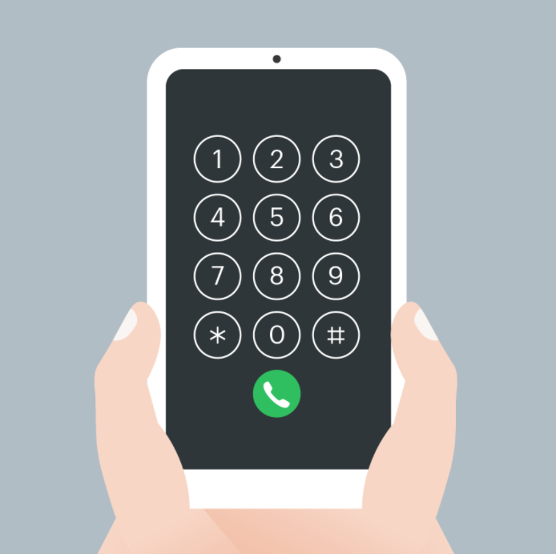
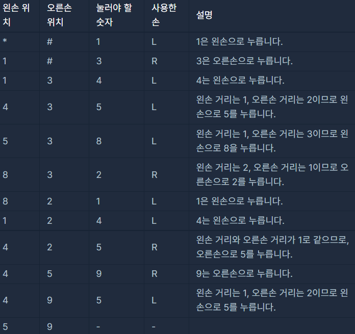

> 최초작성 : 2021.09.26

## ******Level1 - 키패드 누르기**** (java)**

 [코딩테스트 연습 - 키패드 누르기](https://programmers.co.kr/learn/courses/30/lessons/67256)

| **문제 설명** |
| --- |
|스마트폰 전화 키패드의 각 칸에 다음과 같이 숫자들이 적혀 있습니다.<br><br>이 전화 키패드에서 왼손과 오른손의 엄지손가락만을 이용해서 숫자만을 입력하려고 합니다.<br>맨 처음 왼손 엄지손가락은 \* 키패드에 오른손 엄지손가락은 # 키패드 위치에서 시작하며,<br>엄지손가락을 사용하는 규칙은 다음과 같습니다.|
|1.  엄지손가락은 상하좌우 4가지 방향으로만 이동할 수 있으며 키패드 이동 한 칸은 거리로 1에 해당합니다.<br>2.  왼쪽 열의 3개의 숫자 1, 4, 7을 입력할 때는 왼손 엄지손가락을 사용합니다.<br>3.  오른쪽 열의 3개의 숫자 3, 6, 9를 입력할 때는 오른손 엄지손가락을 사용합니다.<br>4.  가운데 열의 4개의 숫자 2, 5, 8, 0을 입력할 때는 두 엄지손가락의 현재 키패드의 위치에서 더 가까운 엄지손가락을 사용합니다.<br>4-1. 만약 두 엄지손가락의 거리가 같다면, 오른손잡이는 오른손 엄지손가락, 왼손잡이는 왼손 엄지손가락을 사용합니다.|
|순서대로 누를 번호가 담긴 배열 numbers,<br>왼손잡이인지 오른손잡이인 지를 나타내는 문자열 hand가 매개변수로 주어질 때,<br>각 번호를 누른 엄지손가락이 왼손인 지 오른손인 지를 나타내는 연속된 문자열 형태로 return 하도록   solution 함수를 완성해주세요. |

| **제한 조건** |
| --- |
|   -   numbers 배열의 크기는 1 이상 1,000 이하입니다.<br>-   numbers 배열 원소의 값은 0 이상 9 이하인 정수입니다.<br>-   hand는 "left" 또는 "right" 입니다.<br>-   "left"는 왼손잡이, "right"는 오른손잡이를 의미합니다.<br>-   왼손 엄지손가락을 사용한 경우는 L, 오른손 엄지손가락을 사용한 경우는 R을 순서대로 이어붙여 문자열 형태로 return 해주세요.   |

| **​입출력 예** |  |  |
| --- | --- | --- |
| numbers | hand | result |
| \[1, 3, 4, 5, 8, 2, 1, 4, 5, 9, 5\] | "right" | "LRLLLRLLRRL" |
| \[7, 0, 8, 2, 8, 3, 1, 5, 7, 6, 2\] | "left" | "LRLLRRLLLRR" |
| \[1, 2, 3, 4, 5, 6, 7, 8, 9, 0\] | "right" | "LLRLLRLLRL" |

입출력 예#1
- 순서대로 눌러야 할 번호가 \[1, 3, 4, 5, 8, 2, 1, 4, 5, 9, 5\]이고, 오른손잡이입니다.

- 따라서 "LRLLLRLLRRL"를 return 합니다

입출력 예#2
- 왼손잡이가 \[7, 0, 8, 2, 8, 3, 1, 5, 7, 6, 2\]를 순서대로 누르면 사용한 손은 "LRLLRRLLLRR"이 됩니다.

---

### _**나의 풀이**_

1. 키패드 배열 생성 :: \*과 #은 -1로 표시

2\. 입력받은 numbers배열의 요소 num을 구하는 반복문을 생성한다.

3\. num이 1,4,7 중에 하나면 answer에 L을 저장하고 해당 숫자의 배열 위치를 lhand에 저장

4\. num이 3,6,9 중에 하나면 answer에 R을 저장하고 해당 숫자의 배열 위치를 rhand에 저장

5\. 그 외의 숫자이면 입력할 값 num의 위치를 loc에 저장

6. loc의 위치와 왼손/오른손의 위치의 차이값을 각각 lDiff/rDiff에 저장

7\. rDiff가 더 가까우면 answer에 R을 저장하고 해당 숫자의 배열 위치를 rhand에 저장

8\. lDiff가 더 가까우면 answer에 L을 저장하고 해당 숫자의 배열 위치를 lhand에 저장

9\. rDiff와 lDiff가 같은 경우 hand에 따라 저장값 관리

```java
class Solution {
    public String solution(int[] numbers, String hand) {
        String answer = "";
        // 01. 키패드 배열 생성 :: *과 #은 -1로 표시
        int[][] key = {{1,4,7,-1},{2,5,8,0},{3,6,9,-1}};
        int[] rhand = {2,3}, lhand = {0,3};	// 오른손과 왼손의 위치 저장
        
        // 02. 입력받은 numbers배열의 요소 num을 구하는 반복문
        for (int num : numbers) {
            for (int i=0; i<key.length; i++) {
            	for (int j=0; j<key[0].length; j++) {
            		if (key[i][j] == num) {
            			// 03. num이 1,4,7 중에 하나면 answer에 L을 저장하고 
            			// 해당 숫자의 배열 위치를 lhand에 저장
            			if (num == 1 || num == 4 || num == 7) {
                    		answer += "L"; lhand[0] = i; lhand[1] = j;
                    	} 
            			// 04. num이 3,6,9 중에 하나면 answer에 R을 저장하고 
            			// 해당 숫자의 배열 위치를 rhand에 저장
            			else if (num == 3 || num == 6 || num == 9) {
                    		answer += "R"; rhand[0] = i; rhand[1] = j;
                    	} 
            			// 05. 그 외의 숫자이면 입력할 값 num의 위치를 loc에 저장
            			else {
                    		int[] loc = {i,j};
                    		// 06. loc의 위치와 왼손/오른손의 위치의 차이값을 각각 lDiff/rDiff에 저장
                    		int rDiff = 
                    				Math.abs(rhand[0]-loc[0]) + Math.abs(rhand[1]-loc[1]);
                    		int lDiff = 
                    				Math.abs(lhand[0]-loc[0]) + Math.abs(lhand[1]-loc[1]);
                    		// 07. rDiff가 더 가까우면 answer에 R을 저장하고
                    		// 해당 숫자의 배열 위치를 rhand에 저장
                    		if (rDiff < lDiff) { answer += "R"; rhand = loc; } 
                    		// 08. lDiff가 더 가까우면 answer에 L을 저장하고
                    		// 해당 숫자의 배열 위치를 lhand에 저장
                    		else if (rDiff > lDiff) { answer += "L"; lhand = loc; }
                    		// 09. rDiff와 lDiff가 같은 경우 hand에 따라 저장값 관리
                    		else if (rDiff == lDiff) {
                    			if (hand.equals("right")) { answer += "R"; rhand = loc; } 
                    			else if (hand.equals("left")) { answer += "L"; lhand = loc; }
                    		}
                    	}
            			continue;
            		}
            	}
            }
        }
        
        return answer;
    }
}
```