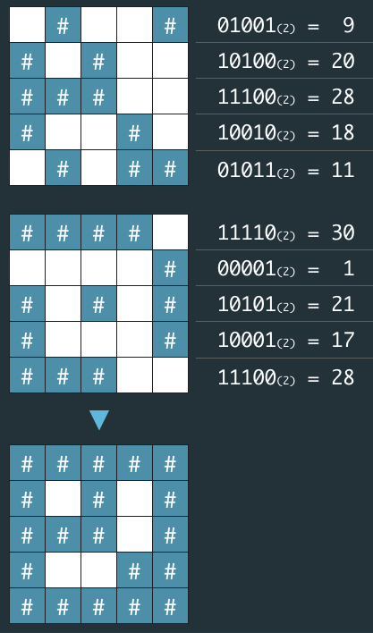

> 최초작성 : 2021.09.13

## ******Level1 - \[1차\] 비밀지도**** (java)**

 [코딩테스트 연습 - \[1차\] 비밀지도](https://programmers.co.kr/learn/courses/30/lessons/17681)

| **문제 설명** |
| --- |
| 네오는 평소 프로도가 비상금을 숨겨놓는 장소를 알려줄 비밀지도를 손에 넣었다.<br>그런데 이 비밀지도는 숫자로 암호화되어 있어 위치를 확인하기 위해서는 암호를 해독해야 한다. 다행히 지도 암호를 해독할 방법을 적어놓은 메모도 함께 발견했다.|
|1.  지도는 한 변의 길이가 n인 정사각형 배열 형태로, 각 칸은 "공백"(" ") 또는 "벽"("#") 두 종류로 이루어져 있다.<br>2.  전체 지도는 두 장의 지도를 겹쳐서 얻을 수 있다. 각각 "지도 1"과 "지도 2"라고 하자. 지도 1 또는 지도 2 중 어느 하나라도 벽인 부분은 전체 지도에서도 벽이다. 지도 1과 지도 2에서 모두 공백인 부분은 전체 지도에서도 공백이다.<br>3.  "지도 1"과 "지도 2"는 각각 정수 배열로 암호화되어 있다.<br>4.  암호화된 배열은 지도의 각 가로줄에서 벽 부분을 1, 공백 부분을 0으로 부호화했을 때 얻어지는 이진수에 해당하는 값의 배열이다.|
|<br>네오가 프로도의 비상금을 손에 넣을 수 있도록, 비밀지도의 암호를 해독하는 작업을 도와줄 프로그램을 작성하라.|

| **입력 형식** |
| --- |
| 입력으로 지도의 한 변 크기 n 과 2개의 정수 배열 arr1, arr2가 들어온다.<br>-   1 ≦ n ≦ 16 -   arr1, arr2는 길이 n인 정수 배열로 주어진다.<br>-   정수 배열의 각 원소 x를 이진수로 변환했을 때의 길이는 n 이하이다. 즉, 0 ≦ x ≦ 2n - 1을 만족한다.   |

| **출력 형식** |
| --- |
| 원래의 비밀지도를 해독하여 '#', 공백으로 구성된 문자열 배열로 출력하라. |

| **​입출력 예 #1**    |  |
| --- | --- |
| 매개변수 | 값 |
| n | 5 |
| arr1 | \[9, 20, 28, 18, 11\] |
| arr2 | \[30, 1, 21, 17, 28\] |
| 출력 | \["#####","# # #", "### #", "# ##", "#####"\] |

| **​입출력 예 #2**    |  |
| --- | --- |
| 매개변수 | 값 |
| n | 6 |
| arr1 | \[46, 33, 33 ,22, 31, 50\] |
| arr2 | \[27 ,56, 19, 14, 14, 10\] |
| 출력 | \["######", "### #", "## ##", " #### ", " #####", "### # "\] |

---

### _**나의 풀이**_

1\. newStr 변수에 arr\[i\]와 arr\[2\]의 or를 저장

2\. newStr의 문자 중 '1'을 '#'으로 변환

3\. newStr의 문자 중 '0'을 ' '로 변환

4\. newStr의 문자 중 앞 공백 추가

```java
class Solution {
  public String[] solution(int n, int[] arr1, int[] arr2) {
    String[] answer = new String[n];

    for (int i=0; i<n; i++){
      // arr[i]와 arr[2]의 or를 저장할 변수 newStr
      String newStr = Integer.toBinaryString(arr1[i] | arr2[i]);
      // newStr의 문자 중 '1'을 '#'으로 변환
      newStr = newStr.replaceAll("1", "#");
      // newStr의 문자 중 '0'을 ' '로 변환
      newStr = newStr.replaceAll("0", " ");
      // newStr의 문자 중 앞 공백 추가
      answer[i] = padLeftSpace(newStr, n);
    }

  return answer;
}

// 앞 공백 추가 함수
public String padLeftSpace(String inputString, int length) {
  // 입력받은 문자열 길이와 답의 길이가 같으면 문자열 그대로 리턴
  if (inputString.length() >= length) {
  	return inputString;
  }
  StringBuilder sb = new StringBuilder();
  // 문자열 앞에 모자란 길이만큼 공백 추가
  while (sb.length() < length - inputString.length()) {
  	sb.append(' ');
  }
  sb.append(inputString);
  return sb.toString();
}
```

<center>

| 분명 답은 맞는 것 같은데 자꾸 틀렸다고 해서 알아보니<br>문자열 길이만큼 앞에 공백을 추가해줘야했다!<br>공백을 추가하는 함수를 생성하여 길이만큼 공백을 추가해줬는데,<br>뭔가 더 간단한 방법이 있을 것 같다. |
| :---: |

</center>

### _**JAVA1 코드 정리**_

1\. arr1과 arr2를 or한 값을 result 배열에 저장

2\. String.format()을 이용하여 문자열 길이만큼 공백 추가

3\. 1을 #으로 변환

4\. 0을 공백으로 변환

```java
class Solution {
  public String[] solution(int n, int[] arr1, int[] arr2) {
    String[] result = new String[n];
    for (int i = 0; i < n; i++) {
      // arr1과 arr2를 or한 값을 result 배열에 저장
      result[i] = Integer.toBinaryString(arr1[i] | arr2[i]);
    }

    // String.format()을 이용하여 문자열 길이만큼 공백 추가
    for (int i = 0; i < n; i++) {
      result[i] = String.format("%" + n + "s", result[i]);
      // 1을 #으로 변환
      result[i] = result[i].replaceAll("1", "#");
      // 0을 공백으로 변환
      result[i] = result[i].replaceAll("0", " ");
    }

    return result;
  }
}
```

<center>

| 나도 처음엔 String.format을 이용하여 문자열에 공백을 정해주려 했으나,<br>n으로 길이를 지정해주는 방법을 몰라 결국 포기했었다.<br>"%"+n+"s" 기억!! |
| :---: |

</center>