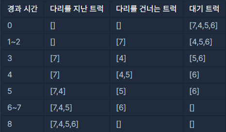

> 최초작성 : 2021.02.28

## ******Level2 - 다리를 지나는 트럭**** (java/kotlin)**

 [코딩테스트 연습 - 다리를 지나는 트럭](https://programmers.co.kr/learn/courses/30/lessons/42583)

| **문제 설명** |
| --- |
| 트럭 여러 대가 강을 가로지르는 일 차선 다리를 정해진 순으로 건너려 합니다. 모든 트럭이 다리를 건너려면 최소 몇 초가 걸리는지 알아내야 합니다. 트럭은 1초에 1만큼 움직이며, 다리 길이는 bridge\_length이고 다리는 무게 weight까지 견딥니다.<br>※ 트럭이 다리에 완전히 오르지 않은 경우, 이 트럭의 무게는 고려하지 않습니다.<br>예를 들어, 길이가 2이고 10kg 무게를 견디는 다리가 있습니다. 무게가 \[7, 4, 5, 6\]kg인 트럭이 순서대로 최단 시간 안에 다리를 건너려면 다음과 같이 건너야 합니다.<br><br>따라서, 모든 트럭이 다리를 지나려면 최소 8초가 걸립니다.<br>solution 함수의 매개변수로 다리 길이 bridge\_length, 다리가 견딜 수 있는 무게 weight, 트럭별 무게 truck\_weights가 주어집니다. 이때 모든 트럭이 다리를 건너려면 최소 몇 초가 걸리는지 return 하도록 solution 함수를 완성하세요.             |

| **제한 조건** |
| --- |
|-   bridge\_length는 1 이상 10,000 이하입니다.|
|-   weight는 1 이상 10,000 이하입니다.|
|-   truck\_weights의 길이는 1 이상 10,000 이하입니다.|
|-   모든 트럭의 무게는 1 이상 weight 이하입니다.   |

| **​입출력 예** |  |  |  |
| --- | --- | --- | --- |
| bridge\_length | weight | truck\_weights | return |
| 2 | 10 | \[7,4,5,6\] | 8 |
| 100 | 100 | \[10\] | 101 |
| 100 | 100 | \[10,10,10,10,10,10,10,10,10,10\] | 110 |

---

### _**나의 풀이**_

1\. 현재 다리를 지나고 있는 트럭을 저장할 큐 truck과 그 truck이 지나온 정도를 저장할 리스트 sc를 선언한다.

2\. 제일 처음 트럭을 truck에 저장하고, bridge\_length를 sc에 저장한다. (리스트의 인덱스로 비교할 예정)

3\. k는 다리에 새로 들어오는 트럭을 저장하기 위한 인덱스 용도이다.

4\. 현재 큐에 있는 트럭의 총 무게를 측정 후 inTruck에 저장한다.

5\. 처음 트럭이 들어왔을 때에는 push 작업을 해주지 않기 위해 second를 이용한 if문을 넣어놨다.7. 

6\. inTruck을 이용해 다음 트럭이 들어왔을 때 무게가 weight를 초과하게 되면 큐에 push하지 않고 진행한다.

   (push를 하지 않았으므로 +1이 된 k를 다시 -1 해준다.)

7\. 무게가 wieght를 초과하지 않으면 큐에 push한다.

8\. 현재 sc에 있는 트럭이 1초가 지났을 경우(for문을 한 번 돌았을 경우) 해당 위치의 값부터 전체 리스트를 -1해준다.

   (이 위치는 k값으로 비교한다.)

7\. 만약 k위치의 sc가 0이 될 경우 제일 끝에 있는 큐 값을 삭제한다.

8\. 모든 트럭이 다 빠져나간 후의 값을 구해야하므로 second에서 +1을 해준다.

```java
import java.util.*;

class Solution {
    public int solution(int bridge_length, int weight, int[] truck_weights) {
        int seconds = 0;
        int inTruck = 0;

        Deque<Integer> truck = new ArrayDeque<Integer>();   // 다리를 지나는 트럭
        ArrayList<Integer> sc = new ArrayList<Integer>();   // 트럭이 다리를 지나는 데 남은 거리

        truck.push(truck_weights[0]);
        sc.add(bridge_length);
        int k=0;

        for (int i = 0; i<truck_weights.length; i++)
        {
            inTruck = 0;
            seconds++;

            for (int t : truck) inTruck += t;

            if (seconds != 1)
            {
                if (k<truck_weights.length)
                {
                    if (inTruck + truck_weights[k] <= weight)
                    {
                        truck.push(truck_weights[k]);
                        sc.add(bridge_length);
                    }
                    else k--;
                }
            }
            for (int j=i; j<sc.size(); j++)
                sc.set(j,sc.get(j)-1);
            if (sc.get(i) == 0) truck.removeLast()
            else i--;
            k++;
        }

        return seconds+1;
    }
}
```

<center>

| 이거 짜는데 진심 죽는 줄 알았다<br>솔직힠ㅋㅋㅋㅋㅋ 내가 써도 무슨 말을 하는지 모르겠다...ㅎㅎ<br>나는 계속 수정하고 고치고 디버깅하는 작업을 반복했기에 내 코드를 이해할 수 있는데<br>아마 조금 시간이 지나서 다시 보라고 하면 진짜 이해하기 힘들 듯..<br>게다가 이걸 말로 푸는게 너무 힘들었다.<br>특히 k의 역할..... 솔직히 야매로 구한 값들이기에 ㅠㅠㅜ<br>‼Queue가 아닌 Deque를 쓴 이유는 그냥 단순히 디버깅할 때 Queue에서 오류 떨어져서...ㅎㅎㅎㅎㅎㅎ<br>그냥 대체제로 Deque를 썼다. 아마 offer가 아닌 add를 써서 오류가 났던 듯 ㅎㅎ |
| :--: |

</center>

### _**JAVA1 코드 정리**_

1\. 대기 중인 트럭을 저장할 waitQ와 이동 중인 트럭을 저장할 moveQ를 선언한다.

2\. 모든 대기 중인 트럭의 데이터(weight, move)를 Truck클래스를 이용해 waitQ에 넣는다.

    (ex. waitQ.peek() = weight:7, move:1)

3\. waitQ와 moveQ 모두 비어있지 않다면 반복문을 실행하고, answer(초)는 1초 증가한다.

4\. 만약 moveQ가 비어있다면, waitQ의 제일 앞 데이터의 weight를 뽑아 curWeight를 계산한다. (curWeight는 다리 위 무게)

5\. moveQ에 뽑아낸 waitQ의 제일 앞 데이터를 삽입하고, 다시 while 반복문을 돈다.

6\. moveQ가 비어있지 않다면, moveQ 내에서 반복문을 도는데, Truck 클래스의 moving() 메소드를 이용해  move +1 증가

7\. 만약 moveQ의 제일 앞 데이터가 bridgeLength보다 크다면 (다리를 다 지나갔다면)

    moveQ의 제일 앞 데이터를 뽑아내고, 이 데이터를 이용해 curWeight를 계산한다.

8\. weightQ가 비어있지 않고, curWeight에 다음 트럭을 더한 무게가 weight보다 작거나 같다면,

    waitQ의 제일 앞 데이터를 뽑아내 curWeight를 계산하고, moveQ에 값을 넣는다. (새 트럭 입장!)

9\. 위 작업을 반복한다.

```java
import java.util.*;

class Solution {
    class Truck {
        int weight;
        int move;

        public Truck(int weight) {
            this.weight = weight;
            this.move = 1;
        }

        public void moving() {
            move++;
        }
    }

    public int solution(int bridgeLength, int weight, int[] truckWeights) {
        Queue<Truck> waitQ = new LinkedList<>();
        Queue<Truck> moveQ = new LinkedList<>();

        for (int t : truckWeights) {
            waitQ.offer(new Truck(t));
        }

        int answer = 0;
        int curWeight = 0;

        while (!waitQ.isEmpty() || !moveQ.isEmpty()) {
            answer++;

            if (moveQ.isEmpty()) {
                Truck t = waitQ.poll();
                curWeight += t.weight;
                moveQ.offer(t);
                continue;
            }

            for (Truck t : moveQ) {
                t.moving();
            }

            if (moveQ.peek().move > bridgeLength) {
                Truck t = moveQ.poll();
                curWeight -= t.weight;
            }

            if (!waitQ.isEmpty() && curWeight + waitQ.peek().weight <= weight) {
                Truck t = waitQ.poll();
                curWeight += t.weight;
                moveQ.offer(t);
            }
        }

        return answer;
    }
}
```

<center>

| 클래스를 이용해 Truck t 라고 선언하는 방법은 내가 한번도 사용해보지 않은 방법이고,<br>잘 모르는 내용이라 처음엔 해석하는 데 어려움을 겪었다.<br>이런 식으로 데이터를 계산하는 법을 새로 배워간다!! 😊<br>근데 확실히 클래스를 따로 뽑아낸 상태에서 계산하니 훨씬 코드가 깔끔해졌다.<br>Truck클래스 내에서 moving(다리를 이동한 거리)를 계산하니 훨씬 편하고, 덜 복잡한 느낌이었다.<br>내가 사용한 list는 앞 데이터도 계속 품고 있는 걸 감안하여 계산해야 한다는 단점이 있는데,<br>이 소스는 move마저도 Queue를 이용해 계산하였기에 제일 앞만 따지면 된다는 이점이 있다.<br>이 소스는 내가 제대로 공부해서 활용만 한다면 엄청 도움되는 코드인 것 같다!! |
| :---: |

</center>

### _**JAVA2 코드 정리**_

1\. 다리를 지날 트럭을 저장할 스택 truckStack과 Map을 선언한다.

2\. 트럭을 역순으로 스택에 push하고 반복문을 도는데, 돌면서 answer(초)는 1 증가한다.

3\. bridgeMap에 answer값과 같은 키가 존재하면 해당 데이터는 삭제한다.

4\. bridgeMap의 데이터들을 모두 더한 값을 sum에 저장한다.

5\. 만약 stack이 비어있지 않고, sum과 다음 트럭의 무게를 더한 값이 weight보다 작거나 같으면

    bridgeMap에 현재 answer 값에 다리의 길이를 key 값, 스택 제일 위에 값을 value로 하는 데이터를 삽입한다.

   (key는 해당 트럭이 다리를 빠져나가는 시간을 계산해서 넣은 것)

6\. Map이 비어있고, 스택도 비어있으면 while문은 종료한다.

```java
import java.util.HashMap;
import java.util.Map;
import java.util.Stack;

class Solution {
    public int solution(int bridge_length, int weight, int[] truck_weights) {
            Stack<Integer> truckStack = new Stack<>();
            Map<Integer, Integer> bridgeMap = new HashMap<>();

            for (int i = truck_weights.length-1; i >= 0; i--)
                truckStack.push(truck_weights[i]);

            int answer = 0;
            int sum = 0;
            while(true) {
                answer++;

                if (bridgeMap.containsKey(answer))
                    bridgeMap.remove(answer);

                sum = bridgeMap.values().stream().mapToInt(Number::intValue).sum();

                if (!truckStack.isEmpty())
                    if (sum + truckStack.peek() <= weight)
                        bridgeMap.put(answer + bridge_length, truckStack.pop());

                if (bridgeMap.isEmpty() && truckStack.isEmpty())
                    break;


            }
            return answer;
    }
}
```

<cetner>

| 이건 Map을 이용해 트럭의 이동 거리를 계산하고, 트럭이 빠져나가는 것을 계산했는데 신박하다고 생각했다.<br>다들 list나 queue를 이용할 때 갑분Map!!<br>미리 트럭이 빠져나간 후의 시간을 계산해 Map key에 넣고, 그 key 값을 만나면 Map을 지워버리는 신박한 방식!<br>어차피 1초가 지날 때마다 트럭이 차례로 들어오므로 key가 겹칠 일이 없으니, 꽤 좋은 방법 같다. |
| :---: |

</center>