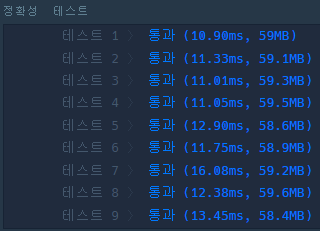

> 최초작성 : 2022.01.12

## ******Level1 - 두 개 뽑아서 더하기**** (kotlin)**

 [코딩테스트 연습 - 두 개 뽑아서 더하기](https://programmers.co.kr/learn/courses/30/lessons/68644)

| **문제 설명** |
| --- |
| 정수 배열 numbers가 주어집니다.<br>numbers에서 서로 다른 인덱스에 있는 두 개의 수를 뽑아 더해서 만들 수 있는 모든 수를<br>배열에 오름차순으로 담아 return 하도록 solution 함수를 완성해주세요. |

| **제한 조건** |
| --- |
|   -   numbers의 길이는 2 이상 100 이하입니다.<br>- numbers의 모든 수는 0 이상 100 이하입니다.   |

| **​입출력 예** |  |
| --- | --- |
| numbers | result |
| \[2,1,3,4,1\] | \[2,3,4,5,6,7\] |
| \[5,0,2,7\] | \[2,5,7,9,12\] |

입출력 예#1
-   2 = 1 + 1 입니다. (1이 numbers에 두 개 있습니다.)
-   3 = 2 + 1 입니다.
-   4 = 1 + 3 입니다.
-   5 = 1 + 4 = 2 + 3 입니다.
-   6 = 2 + 4 입니다.
-   7 = 3 + 4 입니다.
-   따라서 \[2,3,4,5,6,7\] 을 return 해야 합니다.

입출력 예#2
-   2 = 0 + 2 입니다.
-   5 = 5 + 0 입니다.
-   7 = 0 + 7 = 5 + 2 입니다.
-   9 = 2 + 7 입니다.
-   12 = 5 + 7 입니다.
-   따라서 \[2,5,7,9,12\] 를 return 해야 합니다.

---

### _**나의 풀이**_

1\. 두 수를 더한 숫자를 담을 ArrayList를 생성한다.

2\. 두 개의 숫자를 순서대로 뽑은 후 더해서 list에 추가하는데, 이 때 중복되는 값이 이미 존재하면 추가하지 않는다.

3\. answer을 오름차순으로 정렬한 후 리턴한다.

```kt
class Solution {
    fun solution(numbers: IntArray): IntArray {
        var answer: IntArray = intArrayOf()

        for (i in numbers.indices) {
            for (j in numbers.indices) {
                val ins = numbers[i] + numbers[j]
                if (!answer.contains(ins) && i!=j) {
                    answer += ins
                }
            }
        }

        return answer.sortedArray()
    }
}
```



### _**Kotlin1 코드 정리**_

```kt
class Solution {
    fun solution(numbers: IntArray): IntArray {
        val list = numbers.toList()
        return list.withIndex().flatMap { i -> list.withIndex().map { j -> i to j } }
            .filter { it.first.index != it.second.index }
            .map { it.first.value + it.second.value }
            .toSortedSet()
            .toIntArray()
    }
}
```

### _**Kotlin2 코드 정리**_

```kt
class Solution {
    fun solution(numbers: IntArray): IntArray {
        val answers: MutableList<Int> = arrayListOf()
        var sum: Int
        var i = 0
        var j = 0

        while (i < numbers.size - 1) {
            j = i + 1
            while (j < numbers.size) {
                sum = numbers[i] + numbers[j]
                answers.add(sum)
                j++
            }

            i++
        }

        answers.sort()
        return answers.distinct().toIntArray()
    }
}
```

* 코틀린 list에서 distinct()를 사용하면 중복값 제거