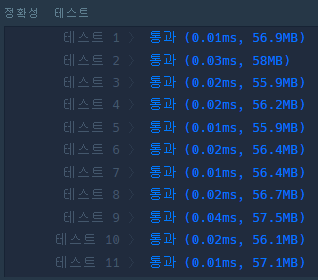
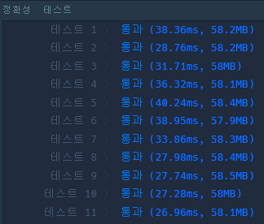

> 최초작성 : 2022.01.12

## ******Level1 - 2016년**** (kotlin)**

 [코딩테스트 연습 - 2016년](https://programmers.co.kr/learn/courses/30/lessons/12901)

| **문제 설명** |
| --- |
| 2016년 1월 1일은 금요일입니다. 2016년 a월 b일은 무슨 요일일까요?<br>두 수 a ,b를 입력받아 2016년 a월 b일이 무슨 요일인지 리턴하는 함수, solution을 완성하세요.<br>요일의 이름은 일요일부터 토요일까지 각각 **_SUN,MON,TUE,WED,THU,FRI,SAT_** 입니다.<br>예를 들어 a=5, b=24라면 5월 24일은 화요일이므로 문자열 TUE를 반환하세요. |

| **제한 조건** |
| --- |
|   -   2016년은 윤년입니다.<br>-   2016년 a월 b일은 실제로 있는 날입니다. (13월 26일이나 2월 45일같은 날짜는 주어지지 않습니다)   |

| **​입출력 예** |  |  |
| --- | --- | --- |
| a | b | result |
| 5 | 24 | "TUE" |

---

### _**나의 풀이 (1)**_

1.  하드코딩

```kt
fun solution1(a: Int, b: Int): String {
    val day = when (a) {
        1 -> b-1
        2 -> 31+b-1
        3 -> 31+29+b-1
        4 -> 31+29+31+b-1
        5 -> 31+29+31+30+b-1
        6 -> 31+29+31+30+31+b-1
        7 -> 31+29+31+30+31+30+b-1
        8 -> 31+29+31+30+31+30+31+b-1
        9 -> 31+29+31+30+31+30+31+31+b-1
        10 -> 31+29+31+30+31+30+31+31+30+b-1
        11 -> 31+29+31+30+31+30+31+31+30+31+b-1
        12 -> 31+29+31+30+31+30+31+31+30+31+30+b-1
        else -> b-1
    }

    return when (day%7) {
        0 -> "FRI"
        1 -> "SAT"
        2 -> "SUN"
        3 -> "MON"
        4 -> "TUE"
        5 -> "WED"
        6 -> "THU"
        else -> "FRI"
    }
}
```



### _**나의 풀이 (2)**_

1.  날짜 차이 계산

```kt
fun solution2(a: Int, b: Int): String {
    val day = (( SimpleDateFormat("yyyy-MM-dd HH:mm:ss").parse("2016-$a-$b 00:00:00").time
                - SimpleDateFormat("yyyy-MM-dd HH:mm:ss").parse("2016-01-01 00:00:00").time
                ) / (60 * 60 * 24 * 1000)
              ).toInt()

    return when (day%7) {
        0 -> "FRI"
        1 -> "SAT"
        2 -> "SUN"
        3 -> "MON"
        4 -> "TUE"
        5 -> "WED"
        6 -> "THU"
        else -> "FRI"
    }
}
```



<center>

| 하드코딩이 속도면에서 월등히 앞선다.   역시 하드코딩이 최고다!! |
| --- |

</center>

### _**Kotlin 코드 정리**_

```kt
class Solution {
    fun solution(a: Int, b: Int): String {
        val days = listOf("THU", "FRI", "SAT", "SUN", "MON", "TUE", "WED")
        val lastDays = listOf(31, 29, 31, 30, 31, 30, 31, 31, 30, 31, 30, 31)

        val result = (0 until a - 1).map {
            lastDays[it]
        }.sum() + b


        return days[result % 7]
    }
}
```