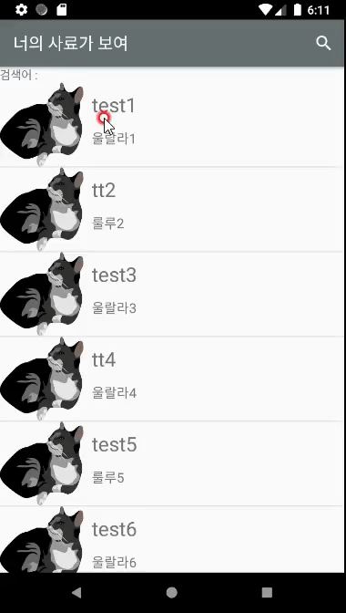
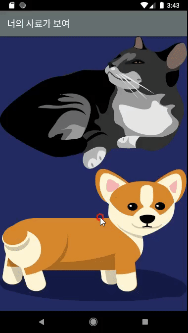
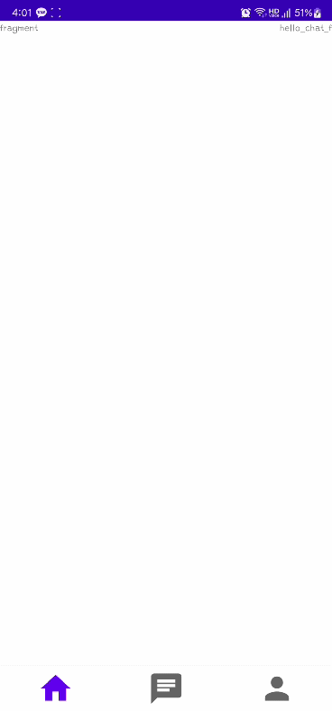

# Android Layout 공부
+ [[java] ListView](#listview)
    + [01.ListView 생성하기](#01-listview-생성하기)
    + [02.ListView Click Event : 팝업창 생성](#02-listview-click-event--팝업창-생성)
    + [03.ListView Search 기능 만들기](#03-listview-search-기능-만들기)
+ [[kotlin] RecyclerView](#recyclerview)
    + [리사이클러뷰 내 Swipe 기능으로 리스트 새로고침](#리사이클러뷰-내-swipe-기능으로-리스트-새로고침)
    + [RecyclerView 내에서 View Binding 사용하기](#recyclerview-내에서-view-binding-사용하기)
+ [[kotlin] BottomNavigationView와 ViewPager2를 이용한 화면 구축](#bottomnavigationview와-viewpager2를-이용한-화면-구축)
+ [[kotlin] Fragment에서 버튼을 생성하여 버튼 클릭 시 Activity로 intent하기](#fragment에서-버튼을-생성하여-버튼-클릭-시-activity로-intent하기)
+ [[kotlin] DB 데이터를 Fragment 내 RecyclerView에 뿌리기(MS-SQL)](#db-데이터를-fragment-내-recyclerview에-뿌리기ms-sql)
+ [[kotlin] 설정화면 구현하기](#설정화면-구현하기)

- - -

## ListView

### 01. ListView 생성하기
> 최초작성 : 2021.02.03


1\. activity\_dog\_main.xml 에 리스트뷰 생성

```xml
<?xml version="1.0" encoding="utf-8"?>
<LinearLayout xmlns:android="http://schemas.android.com/apk/res/android"
    xmlns:app="http://schemas.android.com/apk/res-auto"
    xmlns:tools="http://schemas.android.com/tools"
    android:layout_width="match_parent"
    android:layout_height="match_parent"
    android:orientation="vertical"
    tools:context=".DogMainActivity">

    <ListView
        android:id="@+id/listView"
        android:layout_width="match_parent"
        android:layout_height="match_parent"
        app:layout_constraintBottom_toBottomOf="parent"
        app:layout_constraintEnd_toEndOf="parent"
        app:layout_constraintHorizontal_bias="0.0"
        app:layout_constraintStart_toStartOf="parent"
        app:layout_constraintTop_toTopOf="parent" />
        
 </LinearLayout>
```

2\. 위 리스트뷰 안에 들어갈 레이아웃 생성 (activity\_list\_item.xml)

```xml
<?xml version="1.0" encoding="utf-8"?>
<LinearLayout
    xmlns:android="http://schemas.android.com/apk/res/android"
    xmlns:tools="http://schemas.android.com/tools"
    xmlns:app="http://schemas.android.com/apk/res-auto"
    android:layout_width="match_parent"
    android:layout_height="match_parent"
    tools:context=".list_item">

    <ImageView
        android:id="@+id/imageView1"
        android:layout_width="50dp"
        android:layout_height="100dp"
        android:layout_weight="2"
        android:background="@drawable/cat"
        android:scaleType="centerInside" />

    <LinearLayout
        android:layout_width="wrap_content"
        android:layout_height="match_parent"
        android:layout_weight="9"
        android:orientation="vertical"
        android:weightSum="10">

        <TextView
            android:id="@+id/textView1"
            android:layout_width="match_parent"
            android:layout_height="134dp"
            android:layout_weight="2"
            android:gravity="center_vertical"
            android:text="New Text"
            android:layout_margin="10dp"
            android:textSize="24dp" />

        <TextView
            android:id="@+id/textView2"
            android:layout_width="match_parent"
            android:layout_height="470dp"
            android:layout_weight="6"
            android:text="New Text"
            android:layout_margin="10dp"
            android:textSize="16dp" />

    </LinearLayout>

  </LinearLayout>
```

\* 이미지는 임시로 고양이 이미지 사용

3\. 데이터를 받을 list\_item.java 클래스 생성

```java
public class list_item extends AppCompatActivity {
    public String name;
    public String desc;

    @Override
    protected void onCreate(Bundle savedInstanceState) {
        super.onCreate(savedInstanceState);
        setContentView(R.layout.activity_list_item);
    }

    public list_item(String name, String desc) {
        this.name = name;
        this.desc = desc;
    }

    public String getName()
    {
        return this.name;
    }

    public String getDesc()
    {
        return this.desc;
    }
}
```

4\. dog\_main과 list\_item 클래스를 연결해줄 ListViewAdapter.java 클래스 생성

```java
public class ListViewAdapter extends BaseAdapter {

    Context mContext = null;
    LayoutInflater mLayoutInflater = null;
    ArrayList<list_item> list;

    public ListViewAdapter(Context context, ArrayList<list_item> listViewItemList) {
        mContext = context;
        list = listViewItemList;
        mLayoutInflater = LayoutInflater.from(mContext);
    }

    @Override
    public int getCount() {
        return list.size();
    }

    @Override
    public long getItemId(int position) {
        return position;
    }

    @Override
    public Object getItem(int position) {
        return list.get(position);
    }

    @Override
    public View  getView(int position, View convertView, ViewGroup parent) {
        View view = mLayoutInflater.inflate(R.layout.activity_list_item, null);

        TextView titleTextView = (TextView) view.findViewById(R.id.textView1) ;
        TextView descTextView = (TextView) view.findViewById(R.id.textView2) ;

        titleTextView.setText(list.get(position).getName());
        descTextView.setText(list.get(position).getDesc());

        return view;
    }

}
```

5\. DogMainActivity.java

```java
this.InitializeData();

ListView listview = (ListView) findViewById(R.id.listView);
final ListViewAdapter adapter = new ListViewAdapter(this,DataList);
listview.setAdapter(adapter);

listview.setOnItemClickListener(new AdapterView.OnItemClickListener(){
@Override
public void onItemClick(AdapterView parent, View v, int position, long id){

}
});

XmlPullParser_fsk fsk = new XmlPullParser_fsk();
```

```java
private void InitializeData() {
    DataList = new ArrayList<list_item>();
    DataList.add(new list_item("test1","울랄라1"));
    DataList.add(new list_item("tt2","룰루2"));
    DataList.add(new list_item("test3","울랄라3"));
    DataList.add(new list_item("tt4","울랄라4"));
    DataList.add(new list_item("test5","룰루5"));
    DataList.add(new list_item("test6","울랄라6"));
    DataList.add(new list_item("test7","룰루7"));
    DataList.add(new list_item("tt8","울랄라8"));
}
```

---

### 02. ListView Click Event : 팝업창 생성
> 최초작성 : 2021.02.07



**1\. 팝업창 activity를 생성해준다. (PopupActivity.java, activity\_popup.xml)**

```java
public class PopupActivity extends Activity {

    TextView txtText;

    @Override
    protected void onCreate(Bundle savedInstanceState) {
        super.onCreate(savedInstanceState);
        setContentView(R.layout.activity_popup);

        //UI 객체생성
        txtText = (TextView)findViewById(R.id.txtPopup);

        //데이터 가져오기
        Intent intent = getIntent();
        String data = intent.getStringExtra("data");
        txtText.setText(data);
    }
}
```

\* extends AppCompatActivity를 extends Activity로 변경!!

   AndroidManifest.java 수정 시 충동 생김

**2\. AndroidManifest.java에서 PopupActivity을 Dialog로 변경 (팝업화면)**

```xml
<activity android:name=".PopupActivity" android:theme="@android:style/Theme.Dialog"></activity>
```

**3\. DogMainActivity.java에서 리스트뷰 내 아이템 선택 시 팝업화면 호출**

```java
ListView listview = (ListView) findViewById(R.id.listView);

listview.setOnItemClickListener(new AdapterView.OnItemClickListener(){
  @Override
  public void onItemClick(AdapterView parent, View v, int position, long id){
    String value = "TestPopup \n TestPopup \n TestPopup \n TestPopup "
    	+ "\n TestPopup \n TestPopup \n TestPopup \n TestPopup "
    	+ "\n TestPopup \n TestPopup \n TestPopup \n TestPopup"	// 테스트 문구;
    Log.d(TAG, "선택했어요.");
    Intent intent = new Intent(DogMainActivity.this, PopupActivity.class);
    intent.putExtra("data", value);
    startActivityForResult(intent, 1);
  }
});
```

---

### 03. ListView Search 기능 만들기
> 최초작성 : 2021.02.08



**1\. DogMainActivity.java 내에서 액션바 기능 넣어주기**

```java
@Override
public boolean onCreateOptionsMenu(Menu menu) {
  MenuInflater inflater = getMenuInflater();
  inflater.inflate(R.menu.activity_actionbar_search, menu);

  MenuItem menuItem = menu.findItem(R.id.action_search);
  searchView = (SearchView)menuItem.getActionView();
  searchView.setQueryHint("사료명으로 검색합니다.");
  searchView.setOnQueryTextListener(queryTextListener);

  return super.onCreateOptionsMenu(menu);
}
```

이 때 자꾸 _searchview cannot be cast to android.widget.searchView_ 라는 오류가 났는데

기존 액션바에 검색 기능을 추가할 때

_androidx.appcompat.widget.SearchView_ 를 _android.widget.SearchView_ 로 바꿔주니 해결됐다.

```xml
<?xml version="1.0" encoding="utf-8"?>
<menu xmlns:android="http://schemas.android.com/apk/res/android"
    xmlns:app="http://schemas.android.com/apk/res-auto">

    <item
        android:id="@+id/action_search"
        android:icon="@drawable/menu_search"
        android:title="Search"
        android:orderInCategory="102"
        app:showAsAction="always"
        app:actionViewClass="android.widget.SearchView"/>    <!--이 부분 수정-->

</menu>
```

**2\. 일단 리스트에 넣은 데이터를 따로 복사해두고 거기서 꺼내오는 방법을 사용**

```java
// 검색창에 글자를 입력했을 때 실행코드
private SearchView.OnQueryTextListener queryTextListener = new SearchView.OnQueryTextListener() {
	@Override
	public boolean onQueryTextSubmit(String s) {
		DataList.clear();
		if (s.length() == 0)
			DataList.addAll(searchList);
		else {
			for (int i=0; i<searchList.size(); i++)
			{
				if(searchList.get(i).name.contains(s))
					DataList.add(searchList.get(i));
			}
		}

		adapter.notifyDataSetChanged();
		return false;
	}

	@Override
	public boolean onQueryTextChange(String s) {
		DataList.clear();
		if (s.length() == 0)
			DataList.addAll(searchList);
		else {
			for (int i=0; i<searchList.size(); i++)
			{
				if(searchList.get(i).name.contains(s))
					DataList.add(searchList.get(i));
			}
		}

		adapter.notifyDataSetChanged();
		return false;
	}
};
```

---

## RecyclerView

### 리사이클러뷰 내 Swipe 기능으로 리스트 새로고침
> 최초작성 : 2021.05.16

**1\. SwipeRefreshLayout을 사용하기 위해 implementation 해준다.**

```gradle
implementation "androidx.swiperefreshlayout:swiperefreshlayout:1.1.0"
```

**2\. 리사이클러뷰가 존재하는 xml에서 리사이클러뷰는 SwipeRefreshLayout으로 감싸준다.**

```xml
<androidx.swiperefreshlayout.widget.SwipeRefreshLayout
	android:id="@+id/SwipeRefresh"
	android:layout_width="match_parent"
	android:layout_height="match_parent">

	<androidx.recyclerview.widget.RecyclerView
		android:id="@+id/RecyclerView"
		android:layout_width="match_parent"
		android:layout_height="match_parent"
		android:background="#F0F0F0" />

</androidx.swiperefreshlayout.widget.SwipeRefreshLayout>
```

**3\. 스와이프뷰에 setOnRefreshListener를 통해 리스트를 갱신하는 기능을 넣어준다.**

```kt
view.Swipe_HomeF_SwipeRefresh.setOnRefreshListener {
	// 리사이클러뷰와 연결한 배열을 초기화하고 수정하는 소스를 추가해준다.
    
    // 배열이 변경되었다는 것을 리사이클러뷰에 알려준다
	RecyclerView.adapter?.notifyDataSetChanged()
    // 새로고침 아이콘을 멈춰준다. -> 넣어주지 않으면 무한로딩
	view.Swipe_HomeF_SwipeRefresh.isRefreshing = false
}
```

---

### RecyclerView 내에서 View Binding 사용하기
> 최초작성 : 2021.09.26

**01\. view binding을 사용할 수 있도록 환경 설정**

**_<build.gradle(Module:프로젝트파일명)>_**

```xml
android {
    // 기존 내용들 생략..
    buildFeatures {
        // 뷰 바인딩 활성화
        viewBinding true 
    }
}
```

**02\. Activity / Fragment에서 RecyclerView 설정**

_**<JAVA를 이용한 샘플 코드>**_

```java
binding.recyclerView.setLayoutManager(
	new LinearLayoutManager({this 혹은 context}, LinearLayoutManager.VERTICAL, false));
binding.recyclerView.setAdapter(new {Adapter명: MyAdapter}({리사이클러뷰에 넣을 리스트}));
binding.recyclerView.setHasFixedSize(true);
```

**_<Kotlin을 이용한 샘플 코드>_**

```kt
binding.recyclerView.layoutManager 
	= LinearLayoutManager({this 혹은 context}, LinearLayoutManager.VERTICAL, false)
binding.recyclerView.adapter = {Adapter명: MyAdapter}({리사이클러뷰에 넣을 리스트})
binding.recyclerView.setHasFixedSize(true)
```

**03\. Adapter  설정**

**_<JAVA를 이용한 샘플 코드>_**

```java
public class MyAdapter extends RecyclerView.Adapter<MyAdapter.HomeHolder> {
    ArrayList<String> itemList;
    public MyAdapter(ArrayList<String> itemList) {
        this.itemList = itemList;
    }

    @NonNull
    @Override
    public HomeHolder onCreateViewHolder(@NonNull ViewGroup viewGroup, int viewType) {
        {리사이클러뷰 아이템 레이아웃명 + Binding} binding 
        	= {리사이클러뷰 아이템 레이아웃명 + Binding}
			.inflate(LayoutInflater.from(viewGroup.getContext()), viewGroup, false);
        return new HomeHolder(binding);
    }

    @Override
    public void onBindViewHolder(@NonNull HomeHolder holder, int position) {
        // holder.binding.{아이템} 세팅
    }

    @Override
    public int getItemCount() {
        return itemList.size();
    }

    static class HomeHolder extends RecyclerView.ViewHolder{
        {리사이클러뷰 아이템 레이아웃명 + Binding} binding;
        public HomeHolder({리사이클러뷰 아이템 레이아웃명 + Binding} b){
            super(b.getRoot());
            binding = b;
        }
    }
}
```

**_<Kotlin을 이용한 샘플 코드>_**

```kt
class MyAdapter(private val itemList: ArrayList<String>) : RecyclerView.Adapter<MyHolder>(){
	override fun onCreateViewHolder(viewGroup: ViewGroup, viewType: Int): MyHolder {
		val binding = {리사이클러뷰 아이템 레이아웃명 + Binding}
			.inflate(LayoutInflater.from(viewGroup.context), viewGroup, false)
		return MyHolder(binding)
	}

	override fun getItemCount(): Int {
		return itemList.size
	}

	override fun onBindViewHolder(holder: MyHolder, position: Int) {
		holder.binding.{아이템명} 세팅
	}

	class MyHolder(val binding: {리사이클러뷰 아이템 레이아웃명 + Binding}) : RecyclerView.ViewHolder(binding.root)
}
```

**\* 리사이클러뷰 아이템 레이아웃명 + Binding : 레이아웃이 layout\_list 이면 ListLayoutBinding으로 사용**

## BottomNavigationView와 ViewPager2를 이용한 화면 구축
> 최초작성 : 2021.05.08



**1\. BottomNavigationView와 ViewPager2를 activity\_main.xml에 배치**

```xml
<?xml version="1.0" encoding="utf-8"?>
<RelativeLayout xmlns:android="http://schemas.android.com/apk/res/android"
    xmlns:app="http://schemas.android.com/apk/res-auto"
    xmlns:tools="http://schemas.android.com/tools"
    android:layout_width="match_parent"
    android:layout_height="match_parent"
    tools:context=".MainActivity">

    <!--ViewPager : bottom_nav 위에 위치-->
    <androidx.viewpager2.widget.ViewPager2
        android:id="@+id/vp_Main_ViewPager"
        android:layout_width="match_parent"
        android:layout_height="match_parent"
        android:layout_above="@+id/nav_Main_BottomNav"
        android:layout_alignParentTop="true"
        android:layout_centerHorizontal="true"
        />

    <com.google.android.material.bottomnavigation.BottomNavigationView
        android:id="@+id/nav_Main_BottomNav"
        android:layout_width="match_parent"
        android:layout_height="wrap_content"
        android:layout_alignParentBottom="true"
        android:layout_centerHorizontal="true"
        android:background="#FFFFFF"
        app:itemIconSize="45dp"
        app:labelVisibilityMode="unlabeled"/>

</LinearLayout>
```

\* android:layout\_above="@+id/nav\_Main\_BottomNav"를 통해 viewPager2가 bottomNavigationView 위에 위치

**2\. 위 ViewPager2와 BottomNavigation을 사용하기 위해서는 build.gradle 의존 추가**

```
// 메테리얼 디자인 : BottomNavigation 사용
implementation 'com.google.android.material:material:1.1.0'
// 뷰페이저2
implementation 'androidx.viewpager2:viewpager2:1.0.0'
```

**3\. res 폴더에 menu 폴더를 만들어 BottomNavigation 메뉴 정의**

**_\* Android Resource Directory에서 menu 선택_**

```xml
<?xml version="1.0" encoding="utf-8"?>
<menu xmlns:android="http://schemas.android.com/apk/res/android">
    <item
        android:id="@+id/menu_home"
        android:title="홈"
        android:icon="@drawable/ic_home"
        />
    <item
        android:id="@+id/menu_chat"
        android:title="채팅"
        android:icon="@drawable/ic_chat"
        />
    <item
        android:id="@+id/menu_myPage"
        android:title="마이페이지"
        android:icon="@drawable/ic_mypage"
        />
</menu>
```

\* icon은 직접 drawble 폴더에 넣어도 되고, 안드로이드 스튜디오 아이콘을 사용해도 됨

3-1) drawble 폴더 오른쪽 버튼 > New > Vector Asset > 아이콘 선택 후 Name 변경 저장

**4\. activity\_main.xml 내 bottomNavigation과 menu 연결 위해 app:menu 코드 추가**

```xml
    <com.google.android.material.bottomnavigation.BottomNavigationView
        app:menu="@menu/menu_main_bottomnav"
        android:id="@+id/nav_Main_BottomNav"
        android:layout_width="match_parent"
        android:layout_height="wrap_content"
        android:layout_alignParentBottom="true"
        android:layout_centerHorizontal="true"
        android:background="#FFFFFF"
        app:itemIconSize="45dp"
        app:labelVisibilityMode="unlabeled"/>
```

**5\. 홈, 채팅, 마이페이지 화면을 구현할 Fragment 생성**

```kt
class Main_HomeFragment : Fragment() {
    // 외부에서 접근하여 Main_HomeFragment() 메모리를 가져오기 위한 함수
    companion object {
        fun newInstance() : Main_HomeFragment {
            return Main_HomeFragment()
        }
    }

    // 메모리에 올라갔을 때
    override fun onCreate(savedInstanceState: Bundle?) {
        super.onCreate(savedInstanceState)
        Log.d(TAG, "HomeFragemnt - onCreat() called")
    }

    // 뷰가 생성되었을 때 : 프래그먼트와 레이아웃 연결
    override fun onCreateView(
        inflater: LayoutInflater, container: ViewGroup?,
        savedInstanceState: Bundle?
    ): View? {
        Log.d(TAG, "HomeFragemnt - onCreatView() called")
        val view = inflater.inflate(R.layout.fragment_main_home, container, false)
        return view
    }
}
```

**6\. Fragment 배열 생성 후 FragmentStateAdapter에 연결**

```kotlin
private val homeFragment by lazy { Main_HomeFragment() }
private val chatFragment by lazy { Main_ChatFragment() }
private val myPageFragment by lazy { Main_MypageFragment() }

// 위에서 선언한 fragment를 담는 리스트
private val fragments: List<Fragment> = listOf(
	homeFragment, chatFragment, myPageFragment
)

private val pagerAdapter: MainViewPagerAdapter by lazy {
	// fragment 리스트인 fragments를 MainViewPagerAdapter에 연결
	MainViewPagerAdapter(this, fragments)
}
```

```
// fragment 어댑터
class MainViewPagerAdapter(activity: AppCompatActivity, private val fragments: List<Fragment>) : FragmentStateAdapter(activity) {
    override fun getItemCount(): Int = fragments.size
    override fun createFragment(position: Int): Fragment = fragments[position]
}
```

**7.  BottomNavigation에서 선택된 아이템과 ViewPager의 페이지를 맞춰주기**

```kotlin
// BottomNavigation이 선택되었을 때 실행
nav_Main_BottomNav.run {
    setOnNavigationItemSelectedListener {
        // 선택된 menu_item과 페이지 번호 맞추기
        val page = when (it.itemId) {   // it: 현재 선택된 메뉴 item
            R.id.menu_home -> 0     // it이 menu_home일 때 페이지 번호는 0번
            R.id.menu_chat -> 1     // it이 menu_chat일 때 페이지 번호는 1번
            R.id.menu_myPage -> 2   // it이 menu_myPage일 때 페이지 번호는 2번
            else -> 0               // 기본 0번 (menu_home)
        }

        // 위 when문에 따라 page가 맞지 않을 경우 맞춰주기
        if (page != vp_Main_ViewPager.currentItem) {
            vp_Main_ViewPager.currentItem = page
        }
        true
    }
    selectedItemId = R.id.menu_home
}

// ViewPager2가 변경되었을 때 실행
vp_Main_ViewPager.run {
    adapter = pagerAdapter
    registerOnPageChangeCallback(object : ViewPager2.OnPageChangeCallback() {
        override fun onPageSelected(position: Int) {
            // 선택된 menu_item과 페이지 번호 맞추기
            val navigation = when (position) {
                0 -> R.id.menu_home     // 페이지 번호가 0번일 때, bottom item은 menu_home
                1 -> R.id.menu_chat     // 페이지 번호가 1번일 때, bottom item은 menu_chat
                2 -> R.id.menu_myPage   // 페이지 번호가 2번일 때, bottom item은 menu_myPage
                else -> R.id.menu_home  // 기본 bottom item은 menu_home
            }

            // 위 when문에 따라 bottom item이 맞지 않을 경우 맞춰주기
            if (nav_Main_BottomNav.selectedItemId != navigation) {
                nav_Main_BottomNav.selectedItemId = navigation
            }
        }
    })
}
```

\* MainActivity.java 내 onCreate()에서 실행

\* 아무것도 선택되지 않았을 때(즉 default 값)는 else를 이용해 Main\_HomeFragment() 선택

---

## Fragment에서 버튼을 생성하여 버튼 클릭 시 Activity로 intent하기
> 최초작성 : 2021.05.08

**1\. Fragment 내 intent를 실행시키기 위한 버튼 생성**

```xml
<?xml version="1.0" encoding="utf-8"?>
<LinearLayout xmlns:android="http://schemas.android.com/apk/res/android"
    xmlns:tools="http://schemas.android.com/tools"
    android:layout_width="match_parent"
    android:layout_height="match_parent"
    tools:context=".fragment.Main_ChatFragment">

    <Button
        android:text="테스트1"
        android:textColor="@color/black"
        android:layout_width="wrap_content"
        android:layout_height="wrap_content"
        android:id="@+id/btn1"/>

</LinearLayout>
```

**2\. 버튼의 clicklistener 선언**

```kt
    override fun onCreateView(
        inflater: LayoutInflater, container: ViewGroup?,
        savedInstanceState: Bundle?
    ): View? {
        val view = inflater.inflate(R.layout.___, container, false)
        val go = Intent(context, 이동하고자 하는 액티비티명::class.java) // 인텐트를 생성
        view.btn1.setOnClickListener {
            startActivity(go)
        }
        return view
    }
```

\* view에서 버튼 클릭을 선언하기 위해서는 onCreateView 내에서 생성된 view를 가져와 view 안에 버튼 객체를 불러와야한다.

---

## DB 데이터를 Fragment 내 RecyclerView에 뿌리기(MS-SQL)
> 최초작성 : 2021.05.08

***[DB 데이터 가져오기 참고문서로 이동](../android-server/android-server-study.md/#ms-sql-db-데이터-가져오기)***

**1\. Fragment 내 RecyclerView 생성**

```xml
<?xml version="1.0" encoding="utf-8"?>
<LinearLayout xmlns:android="http://schemas.android.com/apk/res/android"
    xmlns:tools="http://schemas.android.com/tools"
    android:layout_width="match_parent"
    android:layout_height="match_parent"
    tools:context=".fragment._____">

    <androidx.recyclerview.widget.RecyclerView
        android:id="@+id/recyclerView"
        android:layout_width="match_parent"
        android:layout_height="match_parent"
        android:background="#F0F0F0" />

</LinearLayout>
```

**2\. 리사이클러뷰 내에 들어갈 아이템 xml 만들어주기**

_**\* layout 폴더 마우스 우클릭 > layout resource file 선택 > 해당 파일 생성**_

```xml
<?xml version="1.0" encoding="utf-8"?>
<!--fragment_home.xml 내 리사이클러뷰 상세 레이아웃-->
<LinearLayout xmlns:android="http://schemas.android.com/apk/res/android"
    android:orientation="horizontal" android:layout_width="match_parent"
    android:layout_height="wrap_content"
    android:padding="8dp"
    android:gravity="center_vertical"
    android:layout_marginBottom="8dp"
    android:background="@android:color/white">

    <!--상품 이미지-->
    <ImageView
        android:id="@+id/img_Image"
        android:layout_width="100dp"
        android:layout_height="100dp"
        android:src="@mipmap/ic_launcher"
        android:contentDescription="TODO" />

	<LinearLayout
		android:layout_width="match_parent"
		android:layout_height="wrap_content"
		android:orientation="vertical">

		<TextView
			android:id="@+id/txt_Title"
			android:layout_width="wrap_content"
			android:layout_height="wrap_content"
			android:includeFontPadding="false"
			android:text="TITLE"
			android:textSize="24sp"
			android:textColor="@android:color/black"
			android:textStyle="bold"/>

		<TextView
			android:id="@+id/txt_Category"
			android:layout_width="wrap_content"
			android:layout_height="wrap_content"
			android:includeFontPadding="false"
			android:text="categori"
			android:textSize="15sp"
			android:textColor="@android:color/darker_gray"/>
	</LinearLayout>

</LinearLayout>
```

**3\. 데이터를 관리해주는 데이터 모델 클래스 생성**

```kt
data class  rcv_data_list(var data1: Int,
                      val data2: String,
                      val data3: String)
```

**4\. RecyclerView를 연결하기 위한 Adapter 생성**

```kt
class RecyclerViewAdapter(val list: ArrayList<rcv_data_list>) : RecyclerView.Adapter<RecyclerViewHolder>() {

    // onCreateViewHolder() - 아이템 뷰를 위한 뷰홀더 객체 생성하여 리턴
    override fun onCreateViewHolder(parent: ViewGroup, viewType: Int): RecyclerViewHolder {
        val view = LayoutInflater.from(parent.context).inflate(R.layout.recyclerview, parent, false)
        return HomeFragment_RecyclerViewHolder(view)
    }

    // getItemCount() - 전체 데이터 갯수 리턴
    override fun getItemCount(): Int {
        return list.size
    }

    // onBindViewHolder() - position에 해당하는 데이터를 뷰홀더의 아이템뷰에 표시
    override fun onBindViewHolder(holder: HomeFragment_RecyclerViewHolder, position: Int) {
        holder.holder_data2.text = list.get(position).data2
        holder.holder_data3.text = list.get(position).data3

        // 아이템 클릭 이벤트
        holder.itemView.setOnClickListener {
            // 클릭 시 행동
        }
    }
}
```

\* 앞서 DB 데이터를 저장한 배열 data\_list을 매개변수로 받아와 사용

\* onBindViewHolder에서는 선택된 view의 값을 6번에서 생성할 ViewHolder를 통해 가져온다.

\* ViewHolder의 holder의 itemView가 클릭됨 = RecyclerView 내 아이템이 클림됨

**5\. RecyclerView의 layout\_item과 연결되는 ViewHolder 생성**

```kt
class HomeFragment_RecyclerViewHolder(itemView: View): RecyclerView.ViewHolder(itemView) {
    val holder_data1 = itemView.findViewById<ImageView>(R.id.img_Image)
    val holder_data2 = itemView.findViewById<TextView>(R.id.txt_Title)
    val holder_data3 = itemView.findViewById<TextView>(R.id.txt_Category)
}
```

\* RecyclerView의 Item에 들어있는 값들을 각각 변수에 저장 후 5번 Adapter에서 사용

**6\. Fragment 내에서 위 DB select 함수를 호출하고, 리사이클러뷰와 연결함**

```kt
override fun onViewCreated(view: View, savedInstanceState: Bundle?) {
	super.onViewCreated(view, savedInstanceState)
	try {
		// db 테이블 내 전체 컬럼 호출 후 데이터 배열 저장
		Main_DBConnection.DisplayPrdListView("SELECT * FROM 테이블명")

		RecyclerView.layoutManager = LinearLayoutManager(context, LinearLayoutManager.VERTICAL, false)
		RecyclerView.setHasFixedSize(true)
		RecyclerView.adapter = RecyclerViewAdapter(data_list)

	} catch (e: SQLException) {
		e.printStackTrace()
	}
}
```

_**6-1) 리사이클러뷰는 LinearLayoutManager를 통해 4가지 형태로 만들 수 있다.**_

   \* 세로 레이아웃 : 세로 스크롤이 가능 -> LinearLayoutManager(this, LinearLayoutManager.VERTICAL, false)

   \* 가로 레이아웃 : 가로 스크롤이 가능 -> LinearLayoutManager(this, LinearLayoutManager.HORIZONTAL, false)

   \* 불규칙 레이아웃 : 아이템의 높이에 따라 불규칙 적으로 타일 배치

   \* 그리드 레이아웃 : 타일 느낌의 뷰를 생성할 수 있음

_**6-2) RecyclerView.setHasFixedSize(true)의 의미**_

   \* 아이템 항목을 추가할 때마다 리사이클러뷰의 크기는 변경

     > 레이아웃을 그릴 때, 크기를 측정하고 다시 그리는 것을 반복

     > setHasFixedSize는 크기 변경이 일정하다는 것을 사용자의 입력으로 확인

       _: 항목의 높이나 너비가 변경되지 않으며, 추가 또는 제거된 모든 항목은 동일_

---

## 설정화면 구현하기
> 최초작성 : 2021.05.12

**1\. 설정화면(Preference)를 사용하기 위하여 의존성을 주입한다.**

```gradle
//설정화면에서 사용할 preference
implementation 'androidx.preference:preference:1.1.0-alpha01'
```

**2\. 설정 화면을 구현한다. (res>xml 폴더 생성, XML Resource File)**

```xml
<?xml version="1.0" encoding="utf-8"?>
<PreferenceScreen xmlns:android="http://schemas.android.com/apk/res/android">
	<PreferenceCategory android:title="{세팅 타이틀}">
      <CheckBoxPreference
          android:title="{타이틀로 쓸 내용}"
          android:summary="{작은 글씨로 상세 설명을 보여주는 곳}"
          android:key="chbox"
          />
      <ListPreference
          android:title="Ringtone"
          android:summary="벨소리를 선택할 수 있습니다."
          android:key="ls_alarm_bell_choice"
          android:entries="@array/Ringtone"
          android:entryValues="@array/Ringtone"
          />
    </PreferenceCategory>
    <SwitchPreference
        android:title="{타이틀로 쓸 내용}"
        android:summary="{작은 글씨로 상세 설명을 보여주는 곳}"
        android:key="switch"
    />
</PreferenceScreen>
```

\* CheckBoxPreference는 설정을 체크하거나 해제할 수 있도록 지원해준다.

\* SwitchPreference는 설정을 on/off 할 수 있도록 지원해준다.

\* ListPreference는 선택 시 팝업 창으로 선택할 수 있는 리스트들이 뿌려지는데, 이건 values/strings.xml에서 선언해준다.

**_2-1) values/strings.xml에 리스트 추가한다._**

```xml
<string-array name="Ringtone">
	<item>aaa</item>
	<item>bbb</item>
	<item>ccc</item>
	<item>ddd</item>
</string-array>
```

\* string-array의 이름을 name으로 주었으므로 @array/Ringtone을 가져오면 해당 item들이 자동으로 뿌려진다.

**3\. 알람을 세팅해준 xml을 환경 설정 프래그먼트(PreferenceFragment)에 접착시킬 클래스를 하나 생성한다.**

```kt
class SettingsPreference: PreferenceFragmentCompat() {
    override fun onCreatePreferences(savedInstanceState: Bundle?, rootKey: String?) {
        addPreferencesFromResource(R.xml.alarm_settings_layout)
    }
}
```

**4\. 빈 액티비티를 이용하여 설정 화면을 연다.**

```xml
<?xml version="1.0" encoding="utf-8"?>
<fragment xmlns:android="http://schemas.android.com/apk/res/android"
    android:id="@+id/fragment_setting"
    android:name="com.example.{프로젝트명}.fragment.{xml 연결시킨 프래그먼트 클래스명}"
    android:layout_width="match_parent"
    android:layout_height="match_parent">
</fragment>
```

---