# 도서관리 프로그램
* [초안](#초안)
* [로그인, 도서검색](#로그인-도서검색)
* [도서 삭제, 수정](#도서-삭제-수정)
* [관리자 권한 생성](#관리자-권한-생성)
* [도서 대여/반납 로직](#도서-대여반납-로직)
* [회원가입, 도서등록 정규화](#회원가입-도서등록-정규화)

## 초안
> 최초작성 : 2020.12.17

스터디를 처음 나가기 전 '도서관리 프로그램'을 짜오란 얘기를 듣고 밤에 급하게 호다닥 만든 프로그램.

어떤걸 요구하는지 감이 잡히지 않아 네이버에 검색해서 처음 나오는 프로그램을 참고로 만들었다.

(동영상에서는 콤보박스 목록과 메세지박스가 나오지 않는다😢😢)

| 도서명 | TextBox | tbBookName |
| --- | --- | --- |
| 저자명 | TextBox | tbWrName |
| 구분 | RadioButton | rbBook1, rbBook2, rbBook3 |
| <-도서목록-> | ListBox | lsBook |
| 대여 | ComboBox | cbRent |
| 반납 | ComboBox | cbReturn |
| 도서등록 | Button | btnInput |
| 도서삭제  | Button | btnDel |
| 대여  | Button | btnRent |
| 반납  | Button | btnReturn |

  
  

1\. btnInput 선택시 tbBookName, tbWrName, radiobutton.checked 값이 lsBook과 cbRent로 들어간다

```
if (rbBook1.Checked)
{
	lsBook.Items.Add("도서명: " + tbBookName.Text + ", 저자명: " + tbWrName.Text + ", 구분: 교양서적");
	cbRent.Items.Add("도서명: " + tbBookName.Text + ", 저자명: " + tbWrName.Text + ", 구분: 교양서적");
}
else if (rbBook2.Checked)
{
	lsBook.Items.Add("도서명: " + tbBookName.Text + ", 저자명: " + tbWrName.Text + ", 구분: 전공서적");
	cbRent.Items.Add("도서명: " + tbBookName.Text + ", 저자명: " + tbWrName.Text + ", 구분: 전공서적");
}
else
{
	lsBook.Items.Add("도서명: " + tbBookName.Text + ", 저자명: " + tbWrName.Text + ", 구분: 잡지");
	cbRent.Items.Add("도서명: " + tbBookName.Text + ", 저자명: " + tbWrName.Text + ", 구분: 잡지");
}
```

2\. cbRent에서 도서를 선택 후 btnRent을 누르면 cbRent에는 값이 삭제되고 cbReturn에 값이 들어간다.

```
MessageBox.Show("<"+cbRent.Text+"> 을(를) 대여합니다.");
cbReturn.Items.Add(cbRent.Text);
cbRent.Items.Remove(cbRent.Text);
cbRent.Text = "";
```

3\. cbReturn에서 도서를 선택 후 btnReturn을 누르면 cbReturn에는 값이 삭제되고 cbRent에 값이 들어간다.

```
MessageBox.Show("<" + cbReturn.Text + "> 을(를) 반납합니다.");
cbRent.Items.Add(cbReturn.Text);
cbReturn.Items.Remove(cbReturn.Text);
cbReturn.Text = "";
```

4\. lsBook에서 값을 하나 선택하고 btnDel을 누르면 해당 값이 삭제된다.

```
lsBook.Items.RemoveAt(lsBook.SelectedIndex);
```

### \*\*\* **구현 실패** \*\*\*

1\. lsBook에서 도서를 삭제하면 btnRent에 들어간 값도 같이 삭제

### \*\*\* **앞으로 구현 방향** \*\*\*

1\. mssql을 사용한 도서관리 프로그램

2\. 로그인, 회원가입 화면 구현

3\. 출력, 도서 등록 화면 따로 구현

4\. 검색 기능 구현

- - -

## 로그인, 도서검색
> 최초작성 : 2020.12.18

### 01. 로그인 화면

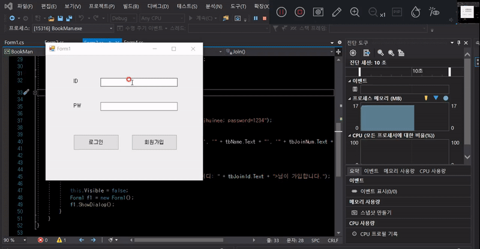

\*\*\* **구현** \*\*\*

1\. 데이터베이스(BookM)과 연결

2\. Login 테이블과 비교하여 id,pw가 있으면 로그인 성공. 없으면 실패.

```
private void Login()
{
  bool login = false; // 로그인 상태 false

  // 데이터베이스 연결
  SqlConnection con = new SqlConnection("~~~");
  con.Open();

  // tbID에 입력된 값으로 데이터 찾기
  string str = "select * from Login where id='" + tbID.Text + "'";
  SqlCommand cmd = new SqlCommand(str, con);
  SqlDataReader mdr = cmd.ExecuteReader();

  while(mdr.Read())
  {
    // 찾은 값의 id와 tbID가 일치하고 pw와 tbPW가 일치하면 로그인상태 true
    if (tbID.Text == (string)mdr["id"] && tbPW.Text == (string)mdr["pw"]) login = true;
  }
  mdr.Close();

  // 로그인 상태가 true일 때
  if (login)
  {
    MessageBox.Show(tbID.Text + "님이 로그인합니다.");

    this.Visible = false;
    Form2 f2 = new Form2();
    f2.ShowDialog();
  }
  // 로그인 상태가 false일 때
  else MessageBox.Show("아이디와 비밀번호를 확인하여 주세요.");
}
```

### 02. 도서 검색 및 등록

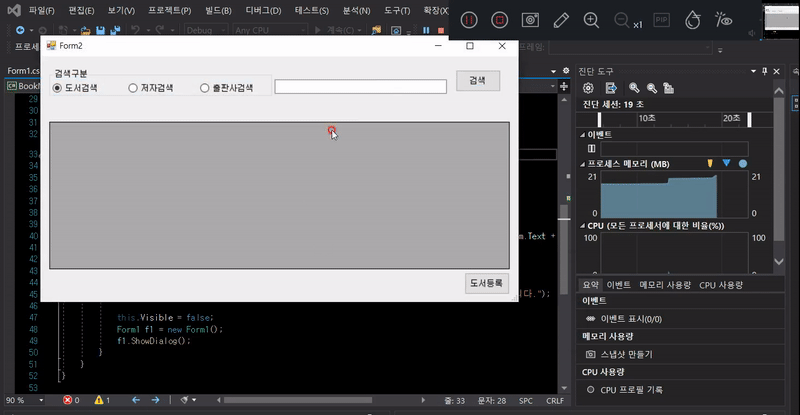

\*\*\* **구현** \*\*\*

1\. bookList 테이블에 있는 목록 출력

```
private void Search()
{
  // DataSet에 테이블 데이터를 넣음
  DataSet ds = new DataSet();
  // 데이터베이스 연결
  SqlConnection con = new SqlConnection("~~~");
  con.Open();
  string sql = "select * from BookList";

  SqlDataAdapter adapter = new SqlDataAdapter(sql, con);

  adapter.Fill(ds, "BookList");
  dgvBookList.DataSource = ds.Tables[0];
}
```

2\. 도서 등록시 해당 내용 insert 후 출력 가능

```
private void Insert()
{
  SqlConnection con = new SqlConnection("~~~");
  con.Open();
  string sql = "insert into BookList values('"
  	+ tbInputBook.Text + "', '" + tbInputWr.Text + "', '" 
    + tbInputCopy.Text + "')";

  SqlCommand cmd = new SqlCommand(sql, con);
  cmd.ExecuteNonQuery();

  MessageBox.Show("<책이름: " + tbInputBook.Text
  	+ ", 저자명: " + tbInputWr.Text
 	+ ", 출판사: " + tbInputCopy.Text + ">가 등록됩니다.");

  this.Visible = false;
  Form2 f2 = new Form2();
  f2.ShowDialog();
}
```

### 03. 회원가입

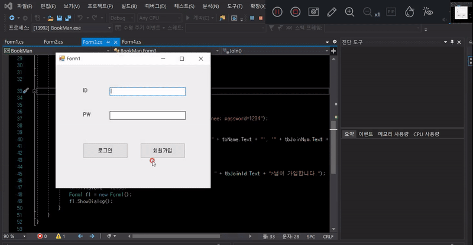

\*\*\* **구현** \*\*\*

1\. 회원가입 시 기존에 존재하는 아이디의 경우 회원가입 실패

2\. 회원가입 후 로그인하면 로그인 성공

```
private void Join()
{
  // 데이터베이스 연결
  SqlConnection con = new SqlConnection("~~~");
  con.Open();
  string sql = "insert into Login values('"
  	+ tbJoinId.Text + "', '" + tbJoinPw.Text + "', '"
    + tbName.Text + "', '" + tbJoinNum.Text + "')";

  SqlCommand cmd = new SqlCommand(sql, con);
  cmd.ExecuteNonQuery();

  MessageBox.Show("<이름: " + tbName.Text + ", 아이디: " 
  	+ tbJoinId.Text + ">님이 가입합니다.");

  this.Visible = false;
  Form1 f1 = new Form1();
  f1.ShowDialog();
}
```

### \*\*\* **앞으로 구현할 것들** \*\*\*

1\. 조금 더 디테일한 데이터 입력

2\. 라디오버튼 선택 & 검색어 입력으로 해당하는 데이터 필터 뽑아 출력

3\. 원하는 데이터셀 선택 후 '삭제' 시 삭제 가능

4\. 데이터셀 선택 후 데이터를 변경하면 값 변경 가능

- - -

## 도서 삭제, 수정

> 최초작성 : 2020.12.19

### 01 로그인 및 회원가입 화면

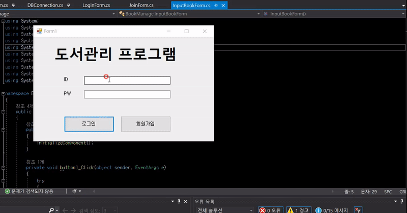

\*\*\* **구현** \*\*\*

1\. 기존과 크게 달라진 것 없음 -> 입력 데이터 양 증가

### 02 도서 검색 및 등록

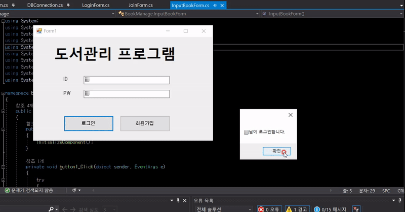

\*\*\* **구현** \*\*\*

1\. 기존과 크게 달라진 것 없음 -> 입력 데이터 양 증가

### 03 도서 수정 및 삭제

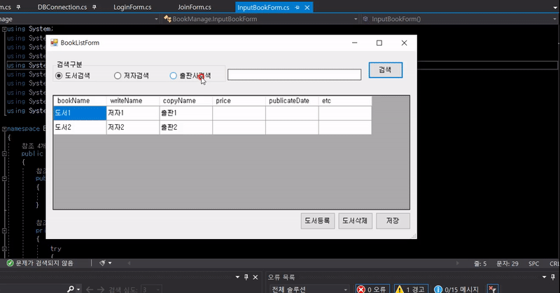

\*\*\* **구현** \*\*\*

1\. 셀 선택 후 \[도서삭제\] 버튼 클릭 시 해당 셀 데이터 삭제

2\. 셀 내용 수정 수 \[저장\] 버튼 클릭 시 해당 셀 데이터 수정

3\. 라디오버튼 선택 후 '포함단어' 검색 알고리즘 구현

```
public BookListForm()
{
  InitializeComponent();

  dgvBookList.CellMouseClick += dgvBookList_CellMouseClick;       // 셀 선택
  dgvBookList.CellValueChanged += dgvBookList_CellValueChanged;   // 셀 변경
}

private void dgvBookList_CellMouseClick(object sender, DataGridViewCellMouseEventArgs e)
{
  int rowIndex = e.RowIndex;
  selectedBookName = dgvBookList.Rows[rowIndex].Cells[0].Value.ToString();
  selectedWriteName = dgvBookList.Rows[rowIndex].Cells[1].Value.ToString();
  selectedCopyName = dgvBookList.Rows[rowIndex].Cells[2].Value.ToString();

  // 조건절
  whereStr = "where BookName='" + selectedBookName
  	+ "' and WriteName='" + selectedWriteName + "' and CopyName='" + selectedCopyName + "'";
}
private void dgvBookList_CellValueChanged(object sender, DataGridViewCellEventArgs e)
{
  int rowIndex = e.RowIndex;
  changeBookName = dgvBookList.Rows[rowIndex].Cells[0].Value.ToString();
  changeWriteName = dgvBookList.Rows[rowIndex].Cells[1].Value.ToString();
  ChangeCopyName = dgvBookList.Rows[rowIndex].Cells[2].Value.ToString();
  ChangePrice = dgvBookList.Rows[rowIndex].Cells[3].Value.ToString();
  ChangePublicateDate = dgvBookList.Rows[rowIndex].Cells[4].Value.ToString();
  ChangeEtc = dgvBookList.Rows[rowIndex].Cells[5].Value.ToString();

  // 업데이트 구문 입력
  changeStr = "BookName='" + changeBookName + "', WriteName='" + changeWriteName + "', "
  	+ "CopyName='" + ChangeCopyName + "', Price='" + ChangePrice + "', "
  	+ "publicateDate='" + ChangePublicateDate + "', etc='" + ChangeEtc + "'";
}
```

### \*\*\* **앞으로 구현할 것들** \*\*\*

1\. try~catch 예외 구문 작성

2\. root(관리자권한) 아이디 생성 및 회원 전용 아이디 권한 부여

3\. 유효성 검사

- - -

## 관리자 권한 생성

> 최초작성 : 2021.02.12|

| **\-#3 대비 수정 사항 -** |
| :--- |
| <br>도서관리 프로그램을 '대여 시스템'으로 수정하면서 DB가 수정됨<br>|
| - BookList 테이블 기본키 : BookNumber (BK+현재날짜)|
| - Quantity 컬럼 생성 (도서 잔여 수량)|
| - 도서명, 저자명, 출판사, 수량 제외 모든 컬럼 삭제 |

### **01\. root 계정으로 로그인 하면 \[도서등록\] \[도서삭제\] \[저장(수정)\] 가능**

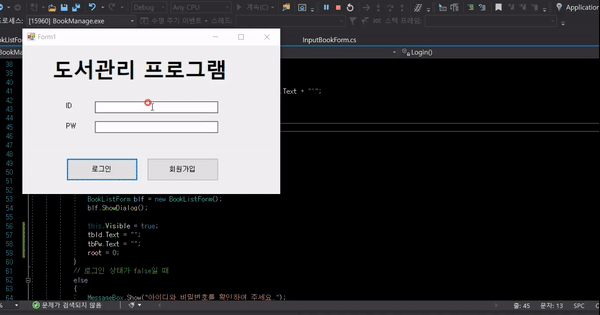

```
public void DataReader(ref bool login)
{
	SqlDataReader mdr = cmd.ExecuteReader();

	try
	{
		while (mdr.Read())
		{
			// 찾은 값의 id와 tbID가 일치하고 pw와 tbPW가 일치하면 로그인상태 true
			if (LoginForm.lf.tbId.Text == (string)mdr["MemId"] 
					&& LoginForm.lf.tbPw.Text == (string)mdr["MemPw"])
			{
				strName = (string)mdr["MemName"];
				if ((string)mdr["MemId"] == "root")
					LoginForm.root = 1;
				login = true;
			}
		}
		mdr.Close();
		cmd.Dispose();
	}
	catch (Exception ex)
	{
		MessageBox.Show(ex.ToString());
	}
}
```

\* DB 클래스에서 로그인 부분에 root 여부 체크를 해준다. (root일 경우 int root = 1)

```
if (LoginForm.root == 1)
{
	btnDel.Visible = true;
	btnInput.Visible = true;
	btnSave.Visible = true;
}
else
{
	btnDel.Visible = false;
	btnInput.Visible = false;
	btnSave.Visible = false;
}
```

\* LoginForm에서 BookListForm 로드할 때 해당 코드 입력

1\. root == 1 일 경우 (관리자 계정일 경우) : \[도서등록\] \[도서삭제\] \[저장(수정)\] 버튼 보이기

2\. root != 1 일 경우 (관리자 계정이 아닐 경우) : \[도서등록\] \[도서삭제\] \[저장(수정)\] 버튼 숨기기

### **02 일반 계정으로 로그인 할 경우 \[도서대출\],\[도서반납\] 버튼만 확인 가능**

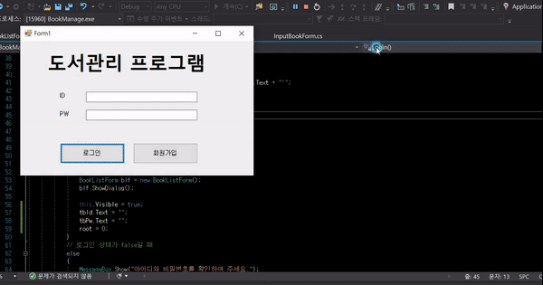

### **03 \[도서대출\] 버튼 선택 시 도서의 잔여 수량이 줄어든다**

![03 [도서대출] 버튼 선택 시 수량 -1](./image/book-m-p-image/04-03.gif)

```
private void btnRent_Click(object sender, EventArgs e)
{
	string str = "update BookList set quantity = " + (selectedQuantity-1) 
    				+ " from BookList " + whereStr;
	dbc.Connection();
	dbc.Command(str);

	MessageBox.Show(selectedBookName+" 도서를 대출합니다.");

	sql = "select * from BookList";
	dbc.Connection();
	dbc.Adaptor(sql);
}
```

### \*\*\* **앞으로 구현할 것들** \*\*\*   

1\. 회원별로 로그인 시 \[도서반납\] 버튼 선택할 때 각 회원의 대여 도서 목록 호출   

2\. 회원별로 로그인 시 \[도서대여\] 버튼 선택할 때 '영수증' 식으로 대여 도서 로그 뿌려주기

3\. root 계정으로 로그인 시 모든 회원 도서 대여 목록, 도서 반납 목록 호출

- - -

## 도서 대여/반납 로직

> 최초작성 : 2021.03.04

### **1\. RentBook라는 새로운 DB 테이블을 생성하였습니다.**

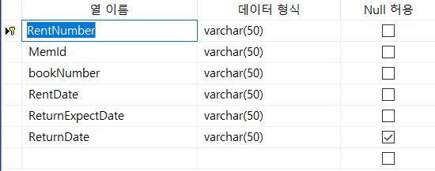

### **2\. \[도서대여\] 버튼을 선택했을 때, 이 DB에 데이터를 추가하도록 하겠습니다.**

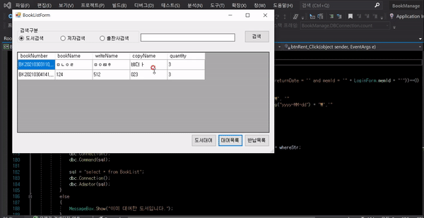
* 해당 도서를 대여하고 있는 경우, 대여가 불가능하다.**

```
private void btnRent_Click(object sender, EventArgs e)
{
    if (selectedQuantity >0)
    {
        if (int.Parse(dbc.count("rentBook", "where bookNumber = '" + selectedBookNumber + "' and returnDate = '' and memId = '" + LoginForm.memId + "'"))==0)
        {

            sql = "insert into RentBook values (\'" + DateTime.Now.ToString("yyyyMMddHHmmss") + "\', '"
                + LoginForm.memId + "\', '" + selectedBookNumber + "\', '" + DateTime.Now.ToString("yyyy-MM-dd") + "\','"
                + DateTime.Now.AddDays(10).ToString("yyyy-MM-dd") + "\','')";
            dbc.Connection();
            dbc.Command(sql);

            MessageBox.Show(selectedBookName + " 도서를 대여합니다.");

            sql = "update BookList set quantity = " + (selectedQuantity - 1) + " from BookList " + whereStr;
            dbc.Connection();
            dbc.Command(sql);

            sql = "select * from BookList";
            dbc.Connection();
            dbc.Adaptor(sql);
        }
        else
        {
            MessageBox.Show("이미 대여한 도서입니다.");
        }
    }
    else
    {
        MessageBox.Show("대여가 불가능합니다.");
    }
}
```

이 때, 중복되는 대여는 대여가 불가능하도록 count() 함수를 사용하여 처리해줍니다.

만약 중복되는 데이터가 해당 회원의 대여 목록에 존재할 경우, count는 1이 될 것입니다.

이때는 else문에 MessageBox를 타게 됩니다.

그렇지 않은 경우 해당 값은 bookList에 insert 되는데 이 때 도서의 수량이 -1 됩니다.

### **3\. \[대여목록\]을 선택한 경우, 해당 회원의 대여 목록이 보이게하고 \[반납목록\]을 선택한 경우, 그동안 회원이 빌려온 도서의 목록을 보이게 합니다.**

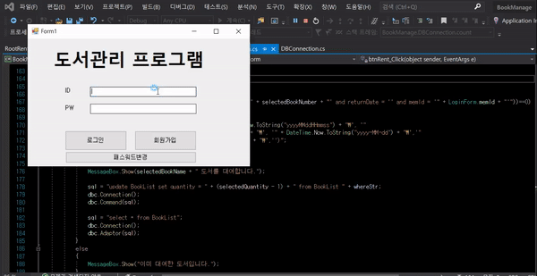

```
private void dgvLoad()
{
    string sql = "";
    string where0 = "where MemId like '" + LoginForm.memId + "' and returnDate = ''";
    string where1 = "where MemId like '" + LoginForm.memId + "' and not returnDate = ''";
    //sql = "select * from RentBook";
    if (BookListForm.btnClick == 0)
    {
        sql = "SELECT RentBook.RentNumber, bookList.bookName, bookList.writeName, bookList.copyName, RentBook.RentDate, RentBook.ReturnExpectDate " +
                "FROM bookList JOIN RentBook ON rentbook.bookNumber = bookList.bookNumber " + where0;
    }
    else if (BookListForm.btnClick == 1)
    {
        sql = "SELECT RentBook.RentNumber, bookList.bookName, bookList.writeName, bookList.copyName, RentBook.RentDate, RentBook.ReturnExpectDate " +
                "FROM bookList JOIN RentBook ON rentbook.bookNumber = bookList.bookNumber " + where1;
    }
}
```

도서대여목록과 반납목록은 RentBook 테이블의 ReturnDate로 통제합니다.

만약 회원이 아직 도서를 반납하지 않은 경우, ReturnDate는 빈 값을 갖게 되고

반납을 한 경우 ReturnDate에는 반납한 일자가 찍힙니다.

### **4\. 대여목록에서 \[도서반납\] 버튼 선택 시 반납이 되도록 하겠습니다.**

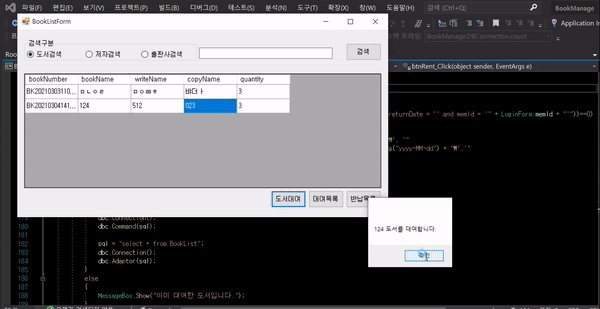

```
private void btnReturn_Click(object sender, EventArgs e)
{
    string sql = "update rentbook set returndate = '" + DateTime.Now.ToString("yyyy-MM-dd") 
        + "' from rentbook where RentNumber = '" + selectedRentNumber + "'";

    dbc.Connection();
    dbc.Command(sql);

    int quantity = int.Parse(dbc.DataLoad("bookList", "where bookNumber = '" + selectedBookNumber + "'", "quantity")) +1;

    sql = "update BookList set quantity = " + quantity + " from BookList where bookNumber = '" + selectedBookNumber + "'";
    dbc.Connection();
    dbc.Command(sql);

    MessageBox.Show(selectedBookNumber + "도서를 반납합니다.");
    dgvLoad();
}
```

이 때, 도서의 수량은 다시 +1 됩니다.

### **5\. where문에 통제를 줘서 root 사용자가 로그인했을 경우, \[대여목록\]과 \[반납목록\]을 선택 시 모든 회원의 자료가 보이도록 설정합니다.**


### \*\*\* 앞으로 구현할 것들 \*\*\*

1\. 회원별로 도서 반납 시 '영수증' 뿌려주기

2\. 도서등록, 회원가입 시 제약사항 걸어주기

3\. 회원별 패스워드 변경 기능

- - -

## 회원가입, 도서등록 정규화

### **1\. 회원가입 할 때 양식에 맞지 않을 경우 TextBox 위에 lable이 표시된다.**

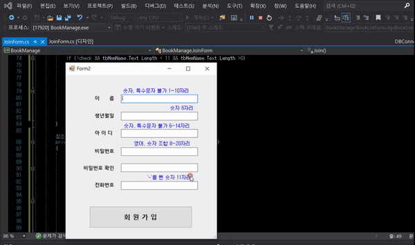

-   정규화를 사용하여 체크 (양식에 맞을 경우 login은 true)
-   login 내 모든 값이 true일 경우에만 회원가입 진행

```
private void tbWriteName_TextChanged(object sender, EventArgs e)
{
    Regex r = new Regex(@"^[^a-zA-Z가-힣]");
    bool check = r.IsMatch(tbWriteName.Text);
    if (!check)
    {
        lbWriteName.Visible = false;
        login[1] = true;
    }
    else
    {
        login[1] = false;
        lbWriteName.Visible = true;
    }
}

private void tbCopyName_TextChanged(object sender, EventArgs e)
{
    Regex r = new Regex(@"^[^a-zA-Z가-힣]");
    bool check = r.IsMatch(tbCopyName.Text);
    if (!check)
    {
        lbCopyName.Visible = false;
        login[2] = true;
    }
    else
    {
        login[2] = false;
        lbCopyName.Visible = true;
    }
}

private void tbQuantity_TextChanged(object sender, EventArgs e)
{
    Regex r = new Regex(@"^[^0-9]");
    bool check = r.IsMatch(tbQuantity.Text);
    if (!check)
    {
        lbQuantity.Visible = false;
        login[3] = true;
    }
    else
    {
        login[3] = false;
        lbQuantity.Visible = true;
    }
}
```

### **2\. root 계정으로 로그인 한 경우, 도서 등록 시 정규화**

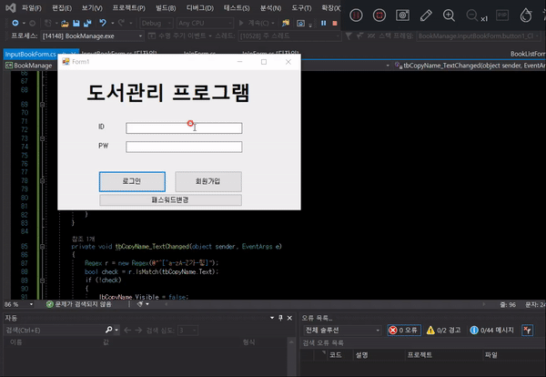

-   위 회원가입과 같은 방법 사용