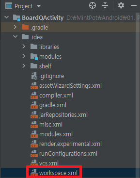

# Android 에러 사항 정리

* [This file does not belong to the project](#This-file-does-not-belong-to-the-project)
* [not permitted by network security policy](#not-permitted-by-network-security-policy)

----
<br>
<br>

# This file does not belong to the project
> 최초작성 : 2021.05.27


프로젝트를 복사한 뒤, 프로젝트 명을 바꾸고 xml 파일을 열어 디자인을 보려고 하니

**This file does not belong to the project**

라는 문구가 떴다.



Project로 변경한 뒤 .idea 폴더에 있는 workspace 파일을 삭제한 뒤 Android Studio를 재실행해준다.

<br>
<br>

# not permitted by network security policy
> 최초작성 : 2021.06.09

> 기존 Web 링크로 된 서버를 로컬 서버로 연결하려고 바꾸니 'not permitted by network security policy' 에러가 발생.

> 안드로이드 9.0(Pie) 버전 이상부터는 https를 기본값으로 지정했는데, http를 연결하려니 발생한 오류였음.

> 이때 http로 구축된 서버를 억지로 https로 바꾸면 time out 오류가 발생함.

> 아래 방법 중 하나를 선택하면 해결 가능함. (https가 아니어도 연결을 허용한다는 뜻)

## 1. AndroidManifest.xml 파일의 <application> 부분에 android:usesCleartextTraffic="true" 로 설정

## 2. res>xml 폴더에 network_security_config.xml파일을 생성하고, AndroidManifest 에 등록


*<xml/network_security_config.xml>*


```xml
<?xml version="1.0" encoding="utf-8"?>
<network-security-config>
    <domain-config cleartextTrafficPermitted="true">
        <domain includeSubdomains="true">허용할 도메인 주소</domain>
    </domain-config>
</network-security-config>
```

*<AndroidManifest.xml>*

```xml
<application 
    android:networkSecurityConfig="@xml/network_security_config" ~~~ >
</application>
```

<br>
<br>