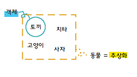

# 객체지향 프로그래밍

## 01. 추상화


### **추상화 개요**

**1\. 추상화란?**

-   복잡한 자료, 모듈, 시스템 등으로부터 핵심적인 개념 또는 기능을 간추려 내는 것
    -   공통의 속성이나 기능을 묶어 이름을 붙이는 것, 객체 지향 관점에 클래스를 정의하는 것을 추상화라 함
    -   불필요한 부분을 생략하고 객체의 속성 중 가장 중요한 것에만 중점을 두어 개략화 하는 것

**2\. 추상화 특징**

-   추상 클래스(Abstract Class)는 추상 메소드(Abstract Method)를 한 개 이상 포함해야함
    -   추상 메소드 : 메소드의 원형만 정의된 독특한 메소드로 "abstract"키워드를 사용하며, 추상 클래스 내에서만 선언
-   추상 클래스는 직접 사용할 수 없으며, 반드시 다른 클래스에서 상속되어 추상 메소드를 오버라이딩 해야 사용이 가능

2-1. 추상화의 중요성

＊ 유지보수의 유리!

1.  코드의 재사용성
2.  가독성을 높이기 때문에 생산성이 높아지고 에러가 감소

2-2. 추상화 주의사항

＊ 하나의 대상에 대하여 목적이나 원하는 기능에 따라 여러 추상화 모델이 생성될 수 있음

-   ex) 학생이라는 클래스와 멀티캠퍼스와 같은 단기 과정을 수강하는 곳의 시스템 내부에서 모델링 되는 학생이란 클래스는 내부의 속성과 오퍼레이션이 서로 많이 다를 것

2-3. 추상화의 구성요소

1.  과정 추상화
    -   프로세스 추상화로 자세한 수행 과정을 정의하지 않고, 전반적인 흐름만 파악할 수 있게 설계하는 방법
    -   이 추상화를 통해 개발자는 코드를 줄 단위가 아닌 함수 단위로 접근할 수 있으며, 이로인해 큰 프로그램을 만들기가 훨씬 수월해짐
2.  데이터 추상화
    -   데이터의 세부적인 속성이나 용도를 정의하지 않고, 데이터 구조를 대표할 수 있는 표현으로 대체하는 것
3.  제어 추상화
    -   이벤트 발생의 정확한 절차나 방법을 정의하지 않고, 대표할 수 있는 표현으로 대체하는 방법

#### **추상화 소스코드 (JAVA)**

A-1. 추상화 전

```java
printf("******....50개가 될 때까지 반복");
```

A-2. 추상화 후

```java
for( i = 0; i < 540; i++){
    printf("*");
}
```

\=> \*을 찍는 행동을 추상화

B-1. 추상화 클래스, 함수 선언

```java
public abstract class Hash {  // 추상 클래스
    int x;                     // 부모 클래스로 객체생성을 방지하기 위해 사용
    int y;                     // 추상 함수가 하나라도 있다면 추상 클래스가 됨
    public Hash() {
        x = 10;
        y = 1;
    }
    public abstract int x ();    // 추상 함수(반환형 앞에 abstrack 표기)
    public int y(){              // 추상 함수는 자식 클래스에서 꼭 오버라이딩 해야한다. 
        return y;
    }
}
```

B-2. 추상화 클래스 사용

```java
public class MainEx {
    Hash h = new Hash();  // 부모 클래스가 추상 클래스이기 때문에 객체 생성이 제한된다.
    Hash h1 = new Hash2();  // 추상 클래스는 자식 클래스로 객체 생성 해야한다.
}
```

---