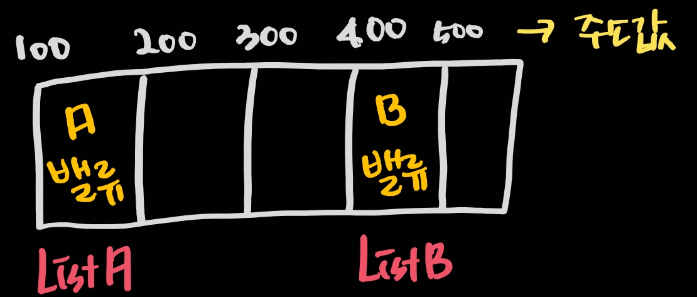
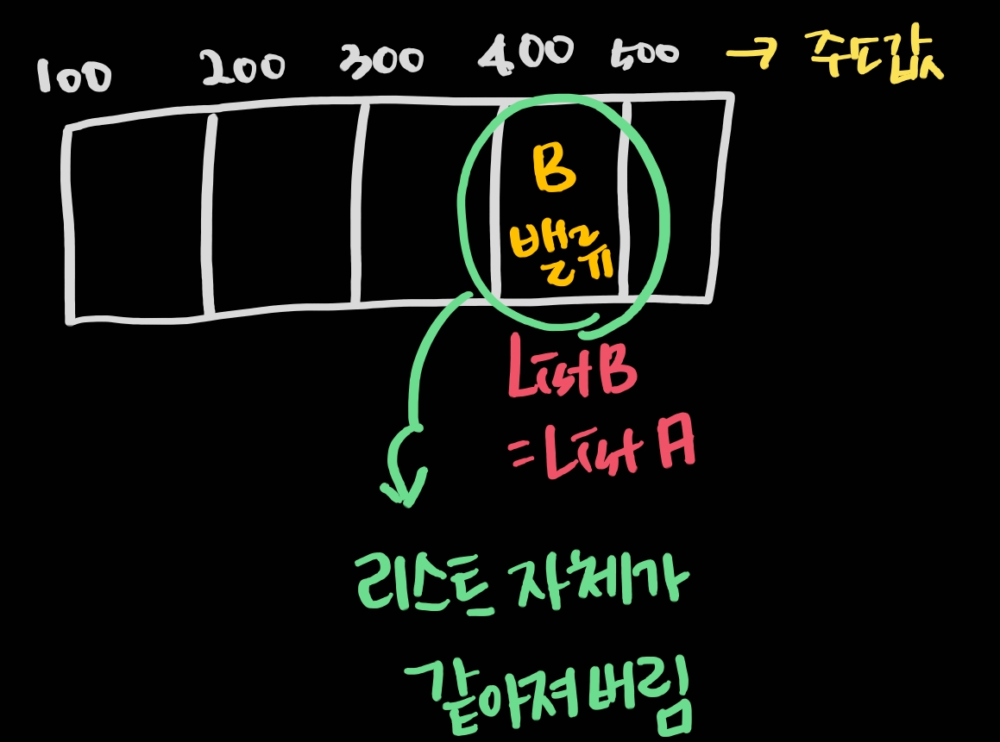

# 참조
* [참조](#참조)

---

## 참조
> 최초작성 : 2022.04.20

안드로이드 프로젝트를 만들면서 문제점을 하나 만났다.<br>
현재 화면에서 보여주고 있는 ListA가 있다.
<br>
그리고 서버와 통신해서 데이터를 받아와 ListA를 누적하는 ListB가 있다.

* 순서1 : ListA(0개) -> ListB(20개)
* 순서1 : ListA(20개) -> ListB(40개)

ListA는 최초에 0개이다. ListA는 ListB보다 언제나 작다.<br>
아이템의 개수를 비교하여 차이나는 아이템만큼 화면에 띄워진 리스트를 업데이트 하려고 한다.

그런데 ListA가 ListB와 언제나 똑같다면?<br>
그래서 리스트가 가진 아이템의 차이를 화면이 파악하지 못한다면?

이유는 참조에 있다.

ListA가 현재 띄워져있는 리스트이자, 화면을 띄우기 위한 어댑터에 연결되어 있는 리스트이다.<br>
ListA에 변경된 ListB를 넣어주려고 한다.

```
ListA = ListB
```

이렇게 선언을 하면 무슨 일이 일어날까?<br>
바로 ListA에 ListB의 value값이 아닌 주소값을 넣어준 것이다.



원하는 결과를 얻기 위해서는 ListA에 B밸류를 넣어줘야 한다.<br>
하지만 위에서 해버린 짓은



ListA의 주소를 ListB로 바꿔버렸다.<br>
그러니 B밸류가 바뀌면 ListA의 value도 같이 바뀌어버린다.

C를 배울 때, 포인터에서 손을 놔버렸는데...<br>
괜히 중요한 개념이 아니었다 ㅠ<br>
포인터를 좀 더 자세히 공부하도록 하자!!