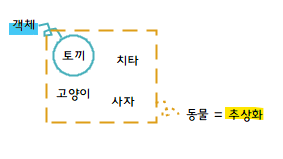

# 프로그래밍 기본
+ [객체지향 프로그래밍](#객체지향-프로그래밍)
    + [객체지향 프로그래밍 - 01. 추상화](#01-추상화)
+ [Interface(인터페이스)](#interface인터페이스)

---

## 객체지향 프로그래밍

### 01. 추상화


#### **추상화 개요**

**1\. 추상화란?**

-   복잡한 자료, 모듈, 시스템 등으로부터 핵심적인 개념 또는 기능을 간추려 내는 것
    -   공통의 속성이나 기능을 묶어 이름을 붙이는 것, 객체 지향 관점에 클래스를 정의하는 것을 추상화라 함
    -   불필요한 부분을 생략하고 객체의 속성 중 가장 중요한 것에만 중점을 두어 개략화 하는 것

**2\. 추상화 특징**

-   추상 클래스(Abstract Class)는 추상 메소드(Abstract Method)를 한 개 이상 포함해야함
    -   추상 메소드 : 메소드의 원형만 정의된 독특한 메소드로 "abstract"키워드를 사용하며, 추상 클래스 내에서만 선언
-   추상 클래스는 직접 사용할 수 없으며, 반드시 다른 클래스에서 상속되어 추상 메소드를 오버라이딩 해야 사용이 가능

2-1. 추상화의 중요성

＊ 유지보수의 유리!

1.  코드의 재사용성
2.  가독성을 높이기 때문에 생산성이 높아지고 에러가 감소

2-2. 추상화 주의사항

＊ 하나의 대상에 대하여 목적이나 원하는 기능에 따라 여러 추상화 모델이 생성될 수 있음

-   ex) 학생이라는 클래스와 멀티캠퍼스와 같은 단기 과정을 수강하는 곳의 시스템 내부에서 모델링 되는 학생이란 클래스는 내부의 속성과 오퍼레이션이 서로 많이 다를 것

2-3. 추상화의 구성요소

1.  과정 추상화
    -   프로세스 추상화로 자세한 수행 과정을 정의하지 않고, 전반적인 흐름만 파악할 수 있게 설계하는 방법
    -   이 추상화를 통해 개발자는 코드를 줄 단위가 아닌 함수 단위로 접근할 수 있으며, 이로인해 큰 프로그램을 만들기가 훨씬 수월해짐
2.  데이터 추상화
    -   데이터의 세부적인 속성이나 용도를 정의하지 않고, 데이터 구조를 대표할 수 있는 표현으로 대체하는 것
3.  제어 추상화
    -   이벤트 발생의 정확한 절차나 방법을 정의하지 않고, 대표할 수 있는 표현으로 대체하는 방법

#### **추상화 소스코드 (JAVA)**

A-1. 추상화 전

```java
printf("******....50개가 될 때까지 반복");
```

A-2. 추상화 후

```java
for( i = 0; i < 540; i++){
    printf("*");
}
```

\=> \*을 찍는 행동을 추상화

B-1. 추상화 클래스, 함수 선언

```java
public abstract class Hash {  // 추상 클래스
    int x;                     // 부모 클래스로 객체생성을 방지하기 위해 사용
    int y;                     // 추상 함수가 하나라도 있다면 추상 클래스가 됨
    public Hash() {
        x = 10;
        y = 1;
    }
    public abstract int x ();    // 추상 함수(반환형 앞에 abstrack 표기)
    public int y(){              // 추상 함수는 자식 클래스에서 꼭 오버라이딩 해야한다. 
        return y;
    }
}
```

B-2. 추상화 클래스 사용

```java
public class MainEx {
    Hash h = new Hash();  // 부모 클래스가 추상 클래스이기 때문에 객체 생성이 제한된다.
    Hash h1 = new Hash2();  // 추상 클래스는 자식 클래스로 객체 생성 해야한다.
}
```

---

## Interface(인터페이스)
> 최초작성 : 2021.07.26

> 추　　가 : 2022.03.13

### **인터페이스 개요**

**1\. 인터페이스란?**

-   사물과 사물 사이 또는 사물과 인간 사이의 경계에서, 상호 간의 소통을 위해 만들어진 물리적 매개체나 프로토콜
-   주로 컴퓨터 분야에서 사용되는 용어이며, I/F로 축약하여 사용
-   구분 : 하드웨어 인터페이스, 소프트웨어 인터페이스, 사용자 인터페이스


v 클래스가 반드시 구현해야 할 행동을 지정하는 데 사용되는 추상 타입<br>
v 행동(Behavior) : 함수 or 메서드 -> 인터페이스에서는 행동을 정의<br>
v 인터페이스를 구현할 때에는 implements 키워드를 사용<br>
v 인터페이스를 구현하고자 한다면, 인터페이스내의 정의된 메소드들은 반드시 구현해야함

**2\. 인터페이스 특징**

1.  100% 추상 클래스
    -   인터페이스의 모든 메소드는 자동으로 public abstract method 가 됨
    -   추상 클래스(abstract class)와 구분하기 위해 선언 시에는 클래스(class) 키워드 대신 인터페이스(interface) 키워드를 사용
2.  다형성 제공
    -   상위 객체에 하위 객체를 참조하게 하여 신규로 추가되는 하위 객체에 대해서도 동일한 규약을 가지게 하는 것처럼 인터페이스(interface)도 추상클래스(abstact class)로서 같은 역할을 수행할 수 있음
3.  상속 트리에 무관하게 적용 가능
    -   상위 객체와 하위 객체의 관계와는 달리 상속 트리 상의 계보를 타지 않더라도전혀 다른 트리상의 객체에 대해서도 인터페이스 적용 가능
4.  여러개 인터페이스 구현
    -   인터페이스는 DDD(Deadly Diamond of Death)를 발생하지 않으므로 하위 클래스는 여러개의 인터페이스를 구현
        -   DDD : 두 클래스 B와 C가 A에서 상속하고 클래스 D가 B와 C 모두에서 상속할 때 발생하는 모호성. B와 C를 재정의하고 D는 재정의하지 않을 때, D는 어떤 버전의 메서드를 상속하나? ~\*<영어라 번역 힘듦..>\*~

**3\. 인터페이스의 장점**

1.  개발 시간 단축
2.  표준과 가능
3.  서로 관계없는 클래스들에 관계를 맺어줌
4.  독립적인 프로그래밍이 가능

## **4\. 인터페이스의 활용**

-   View : 인터페이스 정의(Define) 및 인터페이스와 컨트롤러 연결(Setter) 구현
-   Controller : 인터페이스와 컨트롤러 연결(Setter에 인터페이스 전달 하여 호출)
-   Controller : 인터페이스 함수 구현(Import 혹은 Implements)
-   View : 인터페이스 함수 실행(Run)

### **코틀린 인터페이스**

**1\. 간단한 인터페이스 선언**

```kt
interface Clickable {
    fun click()
}
```

-   이 코드는 click이라는 추상 메소드가 있는 인터페이스를 정의
-   이 인터페이스를 구현하는 모든 비추상 클래스는 click에 대한 구현을 제공해야함

**2\. 단순한 인터페이스 구현**

```kt
class Button: Clickable {
    override fun click() = pringln("I was clicked")
}
```

```
>>> Button().click()
I was clicked
```

-   자바에서는 extends와 implements를 사용하지만, 코틀린에서는 콜론(:)으로 모두 대체
-   클래스는 인터페이스를 원하는 만큼 개수 제한 없이 구현할 수 있지만, 클래스는 오직 하나만 확장할 수 있음.
-   자바의 @Override 애노테이션과 비슷한 override 변경자는 상위 클래스나 상위 인터페이스에 있는 프로퍼티나 메소드를 오버라이드한다는 표시 (자바와 달리 코틀린에서는 override 변경자를 꼭 사용해야 함)

**3\. 인터페이스 안에 본문이 있는 메소드 정의하기**

```kt
interface Clicable {
    fun click()
    fun showOff() = pringln("I'm clickable!")
}
```

-   이 인터페이스를 구현하는 클래스는 click에 대한 구현을 제공해야 함
-   showOff 메소드의 경우 새로운 동작을 정의할 수 있고, 그냥 정의를 생략해서 default 구현을 사용할 수 있음

**4\. 동일 한 메소드를 구현하는 다른 인터페이스 정의**

```kt
interface Focusable {
    fun setFocus (b: Boolean) = println("I ${if (b) "got" else "lost"} focus.")
    fun showOff() = pringln("I'm focusable!")
}
```

-   위 Clicable과 Focusable 인터페이스를 같이 사용할 경우 showOff()는?
    -   컴파일러 오류 발생

**5\. 상속한 인터페이스의 메소드 구현 호출**

```kt
class Button: Clickable, Focusable {
    override fun click() = println("I was clicked")
    override fun showOff() {
        super<Clickable>.showOff()
        super<Focusable>.showOff()
    }
}
```

-   Button 클래스에서 Clickable, Focusable 인터페이스 구현
    -   상속한 두 상위 타입의 showOff() 메소드를 호출하는 방식으로 showOff() 구현
    -   상위 타입의 구현을 호출할 때는 super 사용
        -   사용 : override fun showOff() = super.showOff()

**6\. 버튼 클래스의 인스턴스를 만들고 showOff() 검증**

```kt
fun main(args: Array<String>) {
    val button = Button()
    button.showOff()    // I'm Clickable! \n I'm focusable! 출력
    button.setFocus(true)   // I got focus. 출력
    button.click()  // I was clicked 출력
}
```