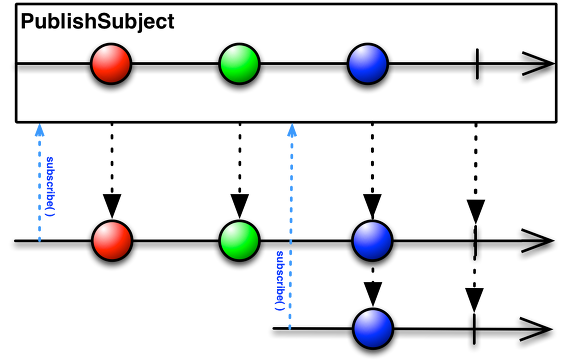

* [Observable이란?](#observable이란) - 2022.03.13
* [RxJava: Subject, PublishSubject, BehaviorSubject](#rxjava-subject-publishsubject-behaviorsubject) - 2022.03.13

* * *

## Observable이란?
> 최초작성: 2022.03.13
* RxJava의 가장 핵심적인 요소
* 데이터 흐름에 맞게 알림을 보내 Observer가 데이터를 사용할 수 있도록 함
- 즉, Observable을 이용해 데이터를 회수하고 변환하는 메커니즘을 정의하고, Observer는 이를 구독해 데이터가 준비되면 반응함

1. Observable이 데이터 스트림을 처리하고, 완료되면 데이터를 발행(emit)
2. 데이터를 발행할 때마다 구독하고 있는 모든 Observer가 알림을 받음
3. Observer는 수신한 데이터를 가지고 어떠한 일을 함

### **관찰자(Observer)패턴이란?**
* 옵저버들의 목록을 객체에 등록해서 상태 변화가 있을 때마다 메서드 등을 통해 객체가 직접 목록의 각 옵저버에게 알리도록 하는 디자인 패턴
* 각각의 옵저버들은 관찰 대상인 객체가 발생시키는 이벤트를 받아 처리
<br>:: 이벤트가 발생하면 각 옵저버들은 콜백을 받음

### **어떻게 Subscribe 가는가?**
Observable이 데이터를 발행하고 알림(Event)을 보내면 Observer는 Observable을 구독(Subscribe)해 데이터를 소비(Consume)한다. 실제로는 Observable이 데이터 흐름을 정의하고 알림을 보낸 뒤 Observer가 Subscribe를 해야 데이터가 발행되고 소비된다.

#### **Observable의 데이터 발행**
```kt
// Emitter를 통해 알림을 보낸다고 생각하면 된다
public interface Emitter<@NonNull T> {
    void onNext(@NonNull T value);  // 데이터의 발행을 알림
    void onError(@NonNull Throwable error); // 모든 데이터의 발행이 완료되었음을 알림, 딱 한 번만 발생하며 이후에 onNext가 발생하면 안됨
    void onComplete();  // 오류가 발생했음을 알림, 이후에 onNext와 onComplete가 발생하지 않음
}
```
#### **Observer의 Subscribe**
구독(Subscribe)이란 단순하게 수신한 데이터를 가지고 할 행동을 정의하는 것이다. Observer는 subsribe() 메소드에서 수신한 각각의 알림에 대해 실행할 내용을 지정한다.
```kt
public final Disposable subscribe()
public final Disposable subscribe(@NonNull Consumer<? super T> onNext)
public final Disposable subscribe(@NonNull Consumer<? super T> onNext, @NonNull Consumer<? super Throwable> onError)
public final Disposable subscribe(@NonNull Consumer<? super T> onNext, @NonNull Consumer<? super Throwable> onError, @NonNull Action onComplete)
public final void subscribe(@NonNull Observer<? super T> observer)
```
#### **총 예제**
```kt
//Observable 생성
Observable<Integer> observable = Observable.create(new ObservableOnSubscribe<Integer>() {
    @Override
    public void subscribe(@NonNull ObservableEmitter<Integer> emitter) throws Throwable {
        // 데이터 흐름 정의
        emitter.onNext(1);
        emitter.onNext(2);
        emitter.onComplete();
        // onComplete() 이후의 데이터는 발행되지 않음
        emitter.onNext(3);
    }
});

// subscribe 함수를 통해 실제로 데이터를 발행하여 소비함
observable.subscribe(
    // onNext
   new Consumer<Integer>() {
       @Override
       public void accept(Integer integer) throws Throwable {
           System.out.println("onNext : " + integer);
       }
   },
   // onError
   new Consumer<Throwable>() {
       @Override
       public void accept(Throwable throwable) throws Throwable {
           System.out.println("onError : " + throwable);

       }
   },
   // onComplete
   new Action() {
       @Override
       public void run() throws Throwable {
           System.out.println("onComplete");
       }
   }
);
```
```
[실행결과]
onNext : 1
onNext : 2
onComplete
```
#### **just()**
가장 간단한 생성 방식이다. 함수에 인자로 넣은 데이터를 차례로 발행한다. 인자로 10개까지 전달할 수 있다. 자동으로 onNext, onComplete 혹은 onError가 호출된다. 데이터가 그대로 발행되므로 다르게 변경하고 싶으면 map과 같은 연산자를 통해 변환해야한다.
```kt
//그대로 발행
Observable.just(1, 2, 3)
        .subscribe(System.out::println);

// 변환하고 싶은 경우
Observable.just(1, 2, 3)
        .map(x -> x * 10)
        .subscribe(System.out::println);
```
```
[실행결과]
1
2
3
[실행결과]
10
20
30
```
#### **create()**
Observable을 생성하지만 just()와는 다르게 프로그래머가 직접 onNext, onComplete, onError를 호출해야한다. 위에서 본 예제에서 쓰인 방식이다.
```kt
//그대로 발행
Observable.create(emitter -> {
    emitter.onNext(1);
    emitter.onNext(2);
    emitter.onNext(3);
    emitter.onComplete();
}).subscribe(System.out::println);
```
```
[실행결과]
1
2
3
```

* * *

## RxJava: Subject, PublishSubject, BehaviorSubject
> 최초작성: 2022.03.13
### **1. Subject**
* 구독하고 있는 관찰자(Observer)에게 새로운 값을 전달 할 때 사용하는 클래스
* 따로 Observable로 새로운 값을 만들 필요 없이 Subject 객체에 내장된 onNext 함수로 새로운 값을 옵저버에 전달할 수 있기 때문에 짧은 코드로고 reactive하게 구현 가능
* LiveData와 비슷한 역할

#### **PublicSubject를 이용해서 새로운 값 갱신 예제**
```kt
class Person {
    var publishName: PublishSubject<String> = PublishSubject.create()
}

val person = Person()
person.publishName.subscribe {
    Log.d(TAG, "publishName: " + it)
}

person.publishName.onNext("selfish")
person.publishName.onNext("developer")
```
```
[실행결과]
publishName: selfish
publishName: developer
```

### 02. PublishSubject vs BehaviorSubject
```kt
class Person {
    var behaviorName: BehaviorSubject<String> = BehaviorSubject.create() // BehaviorSubject 객체 선언
    var publishName: PublishSubject<String> = PublishSubject.create() // PublishSubject 객체 선언
    
    // subject 객체의 값을 한번에 바꾸는 함수
    fun nextName(name: String) {
        behaviorName.onNext(name) publishName.onNext(name)
    }
}

person.nextName("selfish")
person.publishName.subscribe  { Log.d(TAG, "publishName: " + it)  }
person.behaviorName.subscribe { Log.d(TAG, "behaviorName: " + it) }
person.nextName("developer")
```
```
[실행결과]
behaviorName: selfish
behaviorName: developer
publishName: developer
```
* BehaviorSubject로 선언된 객체는 구독 전에 갱신한 "selfish" 문자열을 출력
* PublishSubject로 선언된 객체는 구독 이후에 갱신한 "developer" 문자열만 출력

### 03. PublishSubject
* 구독 이후에 갱신된 값에 대해서만 값을 받음


* 구독하기 이전에 갱신된 빨간공, 초록공은 무시하고 파란공만 받음
* 과거 데이터를 무시하고 새로 갱신된 값만 보고 싶은 경우 사용하기 유용
* 대표적으로 버튼 클릭 이벤트에 많이 사용

### 04. BehaviorSubject
* 구독하는 시점의 가장 최근에 갱신된 값을 받음


* 구독하면서 가장 최근에 갱신된 초록생 공과 그 이후에 갱신된 파란색 공을 받음
* 구독하는 시점에서 과거 갱신된 데이터 중 가장 최근 값이 필요할 때 사용하기 유용