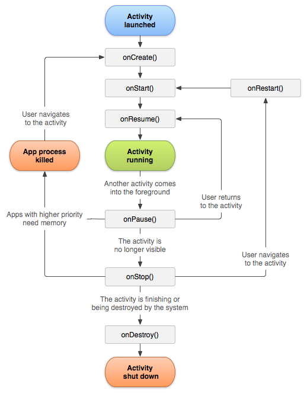
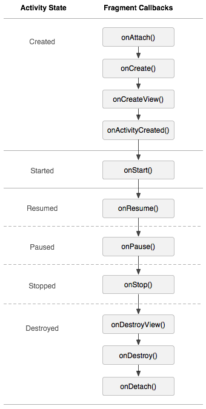

# 안드로이드 기본 기능
- [Life Cycle(생명주기)](#life-cycle-생명주기)
    - [Activity Life Cycle (액티비티 생명 주기)](#activity-life-cycle-액티비티-생명-주기)
    - [Fragment Life Cycle (프래그먼트 생명 주기)](#fragment-life-cycle-프래그먼트-생명-주기)
- [string.xml](#Stringxml)
    - [문자열 리소스란?](#1-문자열-리소스란)
    - string.xml이란?
- [SharedPreference](#sharedpreference)
- [MVVM 패턴](./MVVM.md)
- [RxJava](./RxJava.md)

- - -

## Life Cycle (생명주기)

### Activity Life Cycle (액티비티 생명 주기)
> 최초작성 : 2021.07.23

- 사용자의 행동에 따라 앱의 Activity 인스턴스는 생명 주기 안에서 서로 다른 상태로 전환
- Activity 클래스는 활동 상태 변화를 알아차릴 수 있는 여러 콜백을 제공

**액티비티 생명 주기 단계**



**_1\. onCreate()_**

- 시스템이 먼저 활동을 생성할 때 실행 : **필수적으로 구현**
- 활동의 전체 생명 주기 동안 한 번만 발생해야 하는 기본 애플리케이션 시작 로직을 실행
- onCreate() 메서드 실행을 완료하면 [시작됨](#2-onstart) 상태가 됨
- 주요 기능
    - 사용자 인터페이스 선언(XML 레이아웃 파일 정의)
    - 멤버 변수 정의
    - 일부 UI 구성 등..

```kt
lateinit var textView: TextView
var gameState: String? = null

override fun onCreate(savedInstanceState: Bundle?) {
    // super 클래스 onCreate를 호출
    super.onCreate(savedInstanceState)

    // 인스턴스 상태 복구
    gameState = savedInstanceState?.getString(GAME_STATE_KEY)

    // 사용자 인터페이스 레이아웃 설정 
    // 레이아웃 파일은 프로젝트 res/layout/main_activity.xml 파일에 정의
    setContentView(R.layout.main_activity)

    textView = findViewById(R.id.text_view)
}
```

**_2\. onStart()_**

- 활동이 시작됨 상태에 들어가면 호출
- 이 콜백이 호출되면 활동이 사용자에게 표시되고, 앱은 활동을 포그라운드에 보내 상호작용 할 수 있도록 준비 _(ex. 앱이 UI를 관리하는 코드 초기화)_
- 이 콜백이 완료되면 [재개됨](#3-onresume) 상태가 됨

**_3\. onResume()_**

- 활동이 재개됨 상태에 들어가면 호출
- 이 상태에 들어갔을 때 앱이 사용자와 상호작용
- 어떤 이벤트가 발생하여 앱에서 포커스가 떠날 때까지 앱이 이 상태에 머무름
- 방해되는 이벤트가 발생하면 활동은 [일시중지](#4-onpause) 상태에 들어감 -> 다시 재개됨 상태로 돌아오면 재호출

*_!! 구성요소가 ON\_RESUME 이벤트를 수신할 때 카메라에 액세스하는 생명 주기 인식 구성요소의 예시_*

```kt
class CameraComponent : LifecycleObserver {

    ...

    @OnLifecycleEvent(Lifecycle.Event.ON_RESUME)
    fun initializeCamera() {
        if (camera == null) {
            getCamera()
        }
    }

    ...
}
```

**_4\. onPause()_**

- 사용자가 활동을 떠나는 것을 나타내는 첫 번째 신호로 이 메서드를 호출
- 활동이 포그라운드에 있지 않게 되었다는 것을 나타냄
    - 일부 이벤트로 인해 앱 활동 일시중지
    - Android 7.0(API 수준 24) 이상에서는 여러 앱이 멀티 윈도우 모드에서 실행
    - 새로운 반투명 활동(예: 대화상자)이 열릴 경우, 활동이 여전히 부분적으로 보이지만 포커스 상태가 아닌 경우에는 일시중지

```kt
class CameraComponent : LifecycleObserver {

    ...

    @OnLifecycleEvent(Lifecycle.Event.ON_PAUSE)
    fun releaseCamera() {
        camera?.release()
        camera = null
    }

    ...
}
```

onPause()는 아주 잠깐 실행되므로 저장 작업을 실행하기에는 시간이 부족할 수 있음.  
따라서 애플리케이션 또는 사용자 데이터를 저장하거나, 네트워크 호출을 하거나, 데이터베이스 트랜잭션을 실행해서는 안됨.  
이러한 작업은 메서드 실행이 끝나기 전에 완료되지 못할 수도 있음  
그 대신, 부하가 큰 종료 작업은 [onStop()](#5-onstop) 상태일 때 실행

**_5\. onStop()_**

- 활동이 사용자에게 더 이상 표시되지 않으면 해당 상태로 변경됨
    - 앱이 사용자에게 보이지 않는 동안 앱은 필요하지 않은 리소스를 해제하거나 조정해야 함
        - [onPause()](#4-onpause) 대신 onStop()을 사용하면 사용자가 멀티 윈도우 모드에서 활동을 보고 있더라도 UI 관련 작업이 계속 진행
    - CPU를 비교적 많이 소모하는 종료 작업을 실행
        - 정보를 데이터베이스에 저장할 적절한 시기를 찾지 못했다면 onStop() 상태일 때 저장

```kt
override fun onStop() {
    // 슈퍼클래스 메소드를 먼저 호출
    super.onStop()

    // 활동이 중지되고 현재 진행 상황이 손실되지 않도록 하기 위해
    // 메모리에 현재 초안을 저장
    val values = ContentValues().apply {
        put(NotePad.Notes.COLUMN_NAME_NOTE, getCurrentNoteText())
        put(NotePad.Notes.COLUMN_NAME_TITLE, getCurrentNoteTitle())
    }

    // AsyncQueryHandler 또는 이에 상응하는 백그라운드에서 이 업데이트를 수행
    asyncQueryHandler.startUpdate(
            token,     // int token to correlate calls
            null,      // cookie, not used here
            uri,       // The URI for the note to update.
            values,    // The map of column names and new values to apply to them.
            null,      // No SELECT criteria are used.
            null       // No WHERE columns are used.
    )
}
```

활동은 정지됨 상태에서 다시 시작되어 사용자와 상호작용하거나, 실행을 종료하고 사라짐

- 활동이 다시 시작되면 시스템은 onRestart()를 호출
- Activity가 실행을 종료하면 시스템은 [onDestroy()](#6-ondestroy)를 호출

**_6\. onDestroy()_**

- onDestroy()는 활동이 소멸되기 전에 호출
    - (사용자가 활동을 완전히 닫거나 활동에서 finish()가 호출되어) 활동이 종료되는 경우
    - 구성 변경(예: 기기 회전 또는 멀티 윈도우 모드)으로 인해 시스템이 일시적으로 활동을 소멸시키는 경우

---

### Fragment Life Cycle (프래그먼트 생명 주기)
> 최초작성 : 2021.07.24

-사용자가 앱을 탐색하고 상호 작용할 때 프래그먼트는 추가, 제거, 화면 시작 또는 종료에 따라 생명 주기의 다양한 상태로 전환함

**프래그먼트 생명 주기 상태 및 콜백**



- 프래그먼트의 최대 상태는 FragmentManager에 의해 경정, 조각은 상태 이상으로 진행할 수 없음
- FragmentTransaction의 일부를 사용하여 조각에 최대 생명 주기 상태 설정 가능
- 프래그먼트의 생명 주기 상태는 상위보다 클 수 없음 (ex. 상위 프래그먼트 또는 액티비티는 하위 프래그먼트보다 먼저 시작되어야함)

#### **1\. CREATED**

**_1-1. onCreate()_**

- 프래그먼트를 생성할 때 호출
- Fragment가 사용할 리소스를 초기화
    - 프래그먼트가 일시정지 혹은 중단 후 재개되었을 때 유지하고 있어야 하는 것을 여기서 초기화

**_1-2. onCreateView()_**

-   Fragment가 인터페이스를 처음으로 그릴 때 호출
-   Layout inflate와 UI를 초기화
    -   inflate : 뷰를 그려주는 역할
    -   container : 부모 뷰
    -   이 메서드는 프래그먼트의 레이아웃 루트이기 때문에 UI를 제공하지 않는 경우에는 null을 반환
-   부모 액티비티의 onCreate() 호출 후 실행

**_1-3. onActivityCreated()_**

-   부모 액티비티의 onCreate() 종료 후 실행
-   Fragment,Activity 모두 View 생성이 완료된 상태
-   부모 액티비티의 View 변경 가능

#### **2\. STARTED**

**_2-1. onStart()_**

-   **_Activity 생명주기와 동일_**
-   Fragment가 화면에 표시될 때 호출

#### **3\. RESUMED**

**_3-1. onResume()_**

-   **_Activity 생명주기와 동일_**
-   Fragment가 로딩이 끝나 화면에 완전히 보였을 때 호출

#### **4\. PAUSED**

**_4-1. onPause()_**

-   화면이 중지되면 호출

#### **5\. STOPED**

**_5-1. onStop()_**

-   **_Activity 생명주기와 동일_**
-   Fragment가 종료되는 과정에서 호출

#### **6\. DESTROYED**

**_6-1. onDestroyView()_**

-   Fragment가 있던 자리에 다른 Fragment가 대체될 때 실행
-   Fragment의 View를 제거

**_6-2. onDestroy()_**

-   **_Activity 생명주기와 동일_**
-   어플이 종료되거나, 절전모드 등으로 화면이 꺼지거나, 다른 어플을 실행하는 등 실행

**_6-3. onDetach()_**

-   액티비티로부터 분리될 때 실행

## string.xml
> 최초작성 : ???

### **1. 문자열 리소스란?**
문자열 리소스는 옵션 사항인 텍스트 스타일 지정 및 서식 지정 기능과 함께애플리케이션에 사용할 수 있는 텍스트 문자열을 제공
1. **문자열 : 단일 문자열을 제공하는 XML 리소스**
1. **문자열 배열 : 문자열로 구성된 배열을 제공하는 XML 리소스**
1. **수량 문자열(복수형) : 복수형 표시를 위해 여러 문자열을 포함하는 XML 리소스**

#### (1) 문자열
- 파일 위치 : res/values/filename.xml (<string> 요소의 name이 리소스 ID로 사용됨)
- 리소스 참조 : {Java}R.string.string_name, {XML}@string/string_name
- 구문
```xml
<?xml version="1.0" encoding="utf-8"?>
<resources>
    <string
        name="string_name"
        >text_string</string>
</resources>
```
* 예
```xml
<?xml version="1.0" encoding="utf-8"?>
<resources>
    <string name="hello">Hello!</string>
</resources>
```
```xml
<TextView
    android:layout_width="fill_parent"
    android:layout_height="wrap_content"
    android:text="@string/hello" />
```
- Kotlin
```kotlin
val string: String = getString(R.string.hello)
```
- Java
```java
String string = getString(R.string.hello);
```

<br>

#### (2) 문자열 배열
- 파일 위치 : res/values/filename.xml
- 리소스 참조 : {Java}R.array.string_array_name
- 구문
```xml
<?xml version="1.0" encoding="utf-8"?>
<resources>
    <string-array
        name="string_array_name">
        <item
            >text_string</item>
    </string-array>
</resources>
```
* 예
```xml
<?xml version="1.0" encoding="utf-8"?>
<resources>
    <string-array name="planets_array">
        <item>Mercury</item>
        <item>Venus</item>
        <item>Earth</item>
        <item>Mars</item>
    </string-array>
</resources>
```
- Kotlin
```kotlin
val array: Array = resources.getStringArray(R.array.planets_array)
```
- Java
```Java
Resources res = getResources();
String[] planets = res.getStringArray(R.array.planets_array);
```

#### (3) 수량 문자열(복수형)
- 무조건 복수형에서만 사용해야함.
- zero, one, two, few, many, other 집합 지원

    1. zero : 언어가 숫자 0에 대한 특수한 처리를 요구하는 경우
    1. one : 언어가 1과 같은 숫자에 대한 특수한 처리를 요구하는 경우
    1. two : 언어가 2와 같은 숫자에 대한 특수한 처리를 요구하는 경우
    1. few : 언어가 '작은' 숫자에 대한 특수한 처리를 요구하는 경우
    1. many : 언어가 '큰' 숫자에 대한 특수한 처리를 요구하는 경우
    1. other : 언어가 지정된 수량에 대한 특수한 처리를 요구하는 경우

- 파일 위치 : res/values/filename.xml
- 리소스 참조 : {Java}R.plurals.plural_name
- 구문
```xml
<?xml version="1.0" encoding="utf-8"?>
<resources>
    <plurals
        name="plural_name">
        <item
            quantity=["zero" | "one" | "two" | "few" | "many" | "other"]
            >text_string</item>
    </plurals>
</resources>
```
- 예
```xml
`<?xml version="1.0" encoding="utf-8"?>
<resources>
    <plurals name="numberOfSongsAvailable">
        <!--
             As a developer, you should always supply "one" and "other"
             strings. Your translators will know which strings are actually
             needed for their language. Always include %d in "one" because
             translators will need to use %d for languages where "one"
             doesn't mean 1 (as explained above).
          -->
        <item quantity="one">%d song found.</item>
        <item quantity="other">%d songs found.</item>
    </plurals>
</resources>
```
```xml
<?xml version="1.0" encoding="utf-8"?>
<resources>
    <plurals name="numberOfSongsAvailable">
        <item quantity="one">Znaleziono %d piosenkę.</item>
        <item quantity="few">Znaleziono %d piosenki.</item>
        <item quantity="other">Znaleziono %d piosenek.</item>
    </plurals>
</resources>
```
- kotlin
```kotlin
val count = getNumberOfSongsAvailable()
val songsFound = resources.getQuantityString(R.plurals.numberOfSongsAvailable, count, count)
```
- Java
```java
int count = getNumberOfSongsAvailable();
Resources res = getResources();
String songsFound = res.getQuantityString(R.plurals.numberOfSongsAvailable, count, count);
```

### **2. String.xml이란?**


----


## SharedPreference

> 최초작성 : ???

### ***SharedPreference란?***
- 저장하려는 키-값 컬렉션이 비교적 작은 경우 SharedPreference API를 사용
- 키-값 쌍이 포함된 파일을 가리키며 키-값 쌍을 읽고 쓸 수 있는 간단한 메서드를 제공
- 해당 파일은 프레임워크에서 관리하며 비공개이거나 공유일 수 있음

### 1. 공유 환경설정의 핸들 가져오기
다음 메서드 중 하나를 호출하여 새로운 공유 환경설정 파일을 생성하거나 기존 파일을 엑세스 할 수 있음

- getSharedPreference() : 첫번째 매개변수로 지정하는 이름으로 식별되는 여러 공유 환경설정 파일이 필요한 경우 이 메서드를 사용. 앱의 모든 Context에서 이 메서드를 호출할 수 있음
- getPreference() : 활동에 하나의 공유 환경설정 파일만 사용해야 하는 경우 Activity에서 이 메서드를 사용. 이 메서드는 활동에 속한 기본 공유 환경설정 파일을 검색하기 때문에 이름을 제공할 필요가 없음.

```kotlin
val sharedPref = activity?.getSharedPreferences(
    getString(R.string.preference_file_key), Context.MODE_PRIVATE)
```
```kotlin
val sharedPref = activity?.getPreferences(Context.MODE_PRIVATE)
```

### 2. 공유 환경설정에 쓰기
공유 환경설정 파일에 쓰려면 SharedPreference에서 edit()을 호출하여 SharedPreference.Editor를 만듦

- putInt() 및 putstring()과 같은 메서드를 사용하여 쓰려고 하는 키와 값을 전달
- appy() 또는 commit()을 호출하여 변경사항을 저장

```kotlin
val sharedPref = activity?.getPreferences(Context.MODE_PRIVATE) ?: return
with (sharedPref.edit()) {
	putInt(getString(R.string.saved_high_score_key), newHighScore)
	commit()
}
```

### 3. 공유 환경설정에서 읽기
공유 환경설정 파일에서 값을 검색하려면 getInt() 및 getString()과 같은 메서드를 호출하여 원하는 값에 키를 제공하고 키가 없으면 선택적으로 반환할 기본값을 제공

```kotlin
val sharedPref = activity?.getPreferences(Context.MODE_PRIVATE) ?: return
val defaultValue = resources.getInteger(R.integer.saved_high_score_default_key)
val highScore = sharedPref.getInt(getString(R.string.saved_high_score_key), defaultValue)
```

### ***소스 예제***
#### **(1) Activity 생성 전, SharedPreference를 만들어주는 클래스 App을 생성하고 Manifest에 추가**
```kotlin
/**
  * App.kt
  */
class App: Application() {
    override fun onCreate() {
        super.onCreate()
        // SharedPreference
        SharedPrefUtil.init(applicationContext)
    }
}
```
```xml
<!--AndroidManifest.xml-->

<application
        android:name=".App"
        ...
        
    </activity>
</application>
```

#### **(2) SharePreference Key를 변수로 만들어주고 변수명을 이용해 사용할 예정이므로 해당 변수를 저장해주는 클래스 생성**
```kotlin
/**
  * SharedPrefKey.kt
  * class 대신 object를 사용하면 static처럼 사용할 수 있음
  */
object SharedPrefKey {
    var KEY1: String = "key1"
    var KEY2: String = "key2"
    var KEY3: String = "key3"
}
```

#### **(3) put과 get을 편하게 사용하기 위해 해당 메서드를 정리해놓은 Util 클래스 생성**

```kotlin
/**
  * SharedPrefUtil.kt
  */
object SharedPrefUtil {
    private lateinit var prefs: SharedPreferences

    fun init(context: Context) {
        prefs = context.getSharedPreferences(context.packageName, Activity.MODE_PRIVATE)
    }

    fun put(key: String, value: String) {
        prefs.edit().putString(key, value).apply()
    }
    fun getString(key: String, defValue: String): String {
        return prefs.getString(key, defValue).toString()
    }

    fun put(key: String, value: Int) {
        prefs.edit().putInt(key, value).apply()
    }
    fun getInt(key: String, defValue: Int): String {
        return prefs.getInt(key, defValue).toString()
    }

    fun put(key: String, value: Boolean) {
        prefs.edit().putBoolean(key, value).apply()
    }
    fun getBoolean(key: String, defValue: Boolean): Boolean {
        return prefs.getBoolean(key, defValue)
    }
}
```

#### **(4) SharedPreference 입출력**
```kotlin
SharedPrefUtil.getString(SharedKey.KEY1, "defaultValue")  // 내용읽기
SharedPrefUtil.put(SharedKey.KEY1, "value") // 내용쓰기
```

#### **(5) 내장 저장소에서 SharedPreference 파일 읽기**
- view > Tool Window > Device File Explorer
- data/data/패키지명/sharedPref

----
